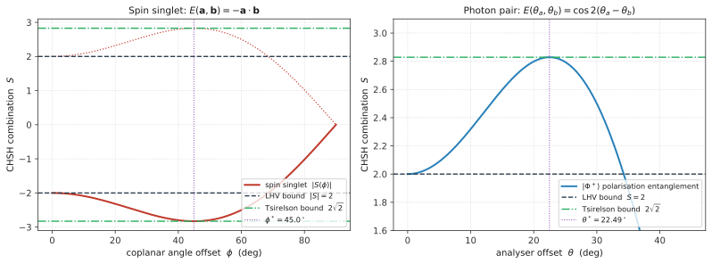
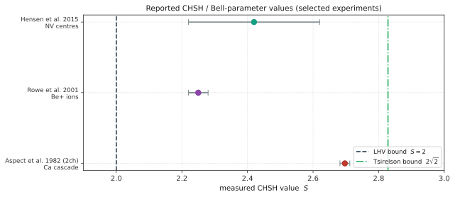

# EPR佯谬与贝尔不等式

> **分类归属：第四部分 量子信息与量子光学 · 数学程度：L2（运算层）· 前置依赖：第 9 篇《量子态与叠加原理》、第 11 篇《希尔伯特空间与狄拉克符号》、第 16 篇《角动量与自旋》、第 29 篇《量子纠缠》**
> **验证依据**：Einstein, Podolsky & Rosen (1935) *Phys. Rev.* 47, 777、Bohr (1935) *Phys. Rev.* 48, 696、Bohm & Aharonov (1957) *Phys. Rev.* 108, 1070、Bell (1964) *Physics* 1, 195、Clauser, Horne, Shimony & Holt (1969) *PRL* 23, 880、Freedman & Clauser (1972) *PRL* 28, 938、Aspect, Grangier & Roger (1982) *PRL* 49, 91、Aspect, Dalibard & Roger (1982) *PRL* 49, 1804、Cirel'son (1980) *Lett. Math. Phys.* 4, 93、Weihs et al. (1998) *PRL* 81, 5039、Rowe et al. (2001) *Nature* 409, 791、Hensen et al. (2015) *Nature* 526, 682、Giustina et al. (2015) *PRL* 115, 250401、Shalm et al. (2015) *PRL* 115, 250402、Tan, Walls & Collett (1991) *PRL* 66, 252、CODATA (2022)、Feynman Lectures Vol. III, §18-3

---

## 一、概念与定位

### 1.1 定义

EPR 佯谬与贝尔不等式是**同一个问题的两个阶段**：EPR 佯谬（1935）是一个论证，其结论为"量子力学对物理实在的描述不完备"；贝尔定理（1964）则把这个形而上学层面的争论，转化为一个**可用实验测量的数值不等式**——任何满足定域性与实在性假设的理论，其可测关联必须落在一个数值界限内，而量子力学预言关联会超出该界限。

一句话概括其核心：

> **存在这样的量子态，其两部分之间的统计关联强于任何"定域 + 实在"模型所能产生的关联，且这一超出已被实验反复确认。**

### 1.2 名称由来

- **EPR**：Einstein-Podolsky-Rosen 三人姓氏首字母。1935 年 5 月发表于《Physical Review》，题为 *Can Quantum-Mechanical Description of Physical Reality Be Considered Complete?*（*Phys. Rev.* 47, 777–780）。
- **"佯谬"（paradox）**：这个译名在 Bell 之后其实已经名不副实。EPR 提出的是一个"二难"：要么承认量子力学不完备，要么承认存在超距作用。Bell 的贡献恰恰在于指出——**这不是二难，而是可判定的**。现代文献中 "EPR paradox" 一词保留，指的是历史论证本身，而非未解决的矛盾。
- **纠缠（Verschränkung / entanglement）**：薛定谔在 1935 年回应 EPR 的文章中造出该词，用以描述 EPR 论证所暴露的那种"两个系统无法分别描述"的状态（卷期页详见第 29 篇《量子纠缠》）。
- **Bell 不等式**：Bell (1964) 原文题为 *On the Einstein Podolsky Rosen Paradox*。此后凡是"由定域实在论推出的、可被量子力学违反的关联约束"都被泛称为 Bell 不等式，形成一个不等式家族（CHSH、CH74、Eberhard、链式不等式等）。
- **CHSH**：Clauser、Horne、Shimony、Holt 四人姓氏首字母，是最常用的实验形式。

### 1.3 核心特征

1. **把哲学问题变成数值问题**。这是本主题最本质的辨识度。在 Bell 之前，"量子力学是否完备"是一个无法诉诸实验的争论；Bell 之后，它变成一个可以写进实验方案的数字：$S \le 2$ 还是 $2\sqrt{2}$。

2. **一个论证 vs 一个定理 vs 一个不等式，三者不可混同**。EPR 是**论证**（推出"不完备"）；Bell 定理是**定理**（定域隐变量理论与量子预言不相容）；Bell/CHSH 不等式是**可检验的约束条件**。日常语言中"EPR 佯谬"常被用来指代全部三者，需要按上下文分辨。

3. **结论是"否定一个合取"，不是"肯定某一个"**。实验违反 Bell 不等式，排除的是"定域性 ∧ 实在性 ∧ 测量选择独立"这个整体，而非其中某一项。放弃其中任何一项都能与实验相容——这是各种诠释的分歧所在（详见第七节）。

4. **三层数值界限构成一个尺度阶梯**：

   | 界限 | 数值 | 来源 |
   |------|------|------|
   | 定域隐变量界 | \|S\| ≤ 2 | 由定域性 + 实在性推出 |
   | Tsirelson 界（量子上限） | \|S\| ≤ 2√2 ≈ 2.828 | 量子力学自身的形式结构 |
   | 无信号代数上限 | \|S\| ≤ 4 | 仅要求不超光速传信 |

   量子力学达到 2√2 而非 4，意味着**量子关联虽强于经典，却并非"最强可能的非定域关联"**。为什么恰好停在 2√2，至今仍是开放问题（见 7.3）。

5. **违反 Bell 不等式不等于可以超光速通信**。关联的强度与信号的可控性是两个不同概念；量子力学满足无信号条件（见 2.8），Bell 违反与狭义相对论并不冲突。

6. **它是量子信息科学的实验基石**。器件无关（device-independent）的量子密钥分发、随机数认证、纠缠检测，其安全性论证最终都归结到"观测到了 Bell 违反"这一事实。2022 年诺贝尔物理学奖授予 Aspect、Clauser、Zeilinger，理由正是"以纠缠光子实验确立 Bell 不等式的违反，并开创量子信息科学"。

### 1.4 在本套笔记体系中的位置

**前置依赖**：需要第 9 篇的叠加原理与第 11 篇的张量积空间（复合系统的态空间），第 16 篇的自旋 1/2 与泡利矩阵（构造具体的 Bell 态与测量算符），以及第 29 篇的纠缠定义（本篇只使用"不可分态"这一概念，纠缠的判据与度量在第 29 篇）。

**后续通向**：第 31 篇《量子测量与退相干》解释为什么宏观世界看不到 Bell 违反；第 32 篇《量子密钥分发》的 E91 协议直接把 CHSH 违反作为窃听检测手段；第 34 篇《量子计算与量子算法》中 Bell 违反是验证量子比特纠缠的标准诊断。

**与宝石学笔记的接口**：`宝石学正式版/` 中的《双折射后的光是否纠缠态》提出的一个结论——"单粒子偏振-路径纠缠不直接体现 EPR 非定域性"——其理论依据就在本篇（见 5.3 与 6.4）。

---

## 二、数学结构

### 2.1 符号约定声明

本篇统一采用以下约定，全文不再切换：

- **单位制**：SI。涉及常数的数值均取自 **CODATA 2022** 推荐值。
- **ħ 与 2π**：本篇所有关联函数与不等式均为无量纲量，不含 ħ；相干项写作 exp(−iEt/ħ)，不额外吸收 2π。
- **度规与张量积**：采用 ⊗ 标记复合系统，左因子属于粒子 1（Alice 侧），右因子属于粒子 2（Bob 侧）。
- **自旋算符**：$\hat{\boldsymbol{\sigma}} = (\hat\sigma_x, \hat\sigma_y, \hat\sigma_z)$ 为泡利矩阵，自旋算符 $\hat{\mathbf{S}} = \frac{\hbar}{2}\hat{\boldsymbol{\sigma}}$。
- **测量方向**：$\mathbf{a}, \mathbf{a}', \mathbf{b}, \mathbf{b}'$ 均为三维实单位矢量；共面情形下用标量角 $\theta$ 表示，角度均为弧度制，图上标注换算为度。
- **关联函数符号**：$E(\mathbf{a},\mathbf{b}) \in [-1, +1]$，定义为两侧测量结果乘积的期望值。注意不同文献用 $P$ 或 $E$ 表示同一量（Bell 1964 用 $P$，CHSH 及后续文献多用 $E$），本篇统一用 $E$，引述 Bell 原式时保留 $P$。
- **傅里叶变换**：本篇不涉及。

### 2.2 态空间与 Bell 基

考虑两个自旋 1/2 粒子，单粒子态空间 $\mathcal{H}_2 \cong \mathbb{C}^2$，复合系统态空间为

$$\mathcal{H} = \mathcal{H}_2 \otimes \mathcal{H}_2 \cong \mathbb{C}^4 \tag{2.1}$$

| 符号 | 含义 | 量纲 |
|------|------|------|
| $\mathcal{H}_2$ | 单粒子自旋态空间，维数 2 | — |
| $\otimes$ | 张量积 | — |

最常用的两个 Bell 态是**自旋单态**与**三重态之一**：

$$|\Psi^-\rangle = \frac{1}{\sqrt{2}}\left(|\uparrow\downarrow\rangle - |\downarrow\uparrow\rangle\right) \tag{2.2}$$

$$|\Phi^+\rangle = \frac{1}{\sqrt{2}}\left(|\uparrow\uparrow\rangle + |\downarrow\downarrow\rangle\right) \tag{2.3}$$

| 符号 | 含义 | 量纲 |
|------|------|------|
| $|\Psi^-\rangle$ | 自旋单态，总自旋量子数 $s=0$，$m_s=0$；在任意方向上呈现完美反关联 | — |
| $|\uparrow\rangle, |\downarrow\rangle$ | $\hat\sigma_z$ 的本征态，本征值 $+1, -1$ | — |
| $|\uparrow\downarrow\rangle$ | 简写，指 $|\uparrow\rangle_1 \otimes |\downarrow\rangle_2$ | — |

$|\Psi^-\rangle$ 的关键性质是**旋转不变性**：它在任意共同旋转下不变，因此在任何方向 $\mathbf{v}$ 上都可写作 $|\Psi^-\rangle = \frac{1}{\sqrt{2}}(|\uparrow_{\mathbf{v}}\downarrow_{\mathbf{v}}\rangle - |\downarrow_{\mathbf{v}}\uparrow_{\mathbf{v}}\rangle)$。这正是它能产生完美反关联的根源。

### 2.3 算符与关联函数

在 Alice 侧沿 $\mathbf{a}$ 方向、Bob 侧沿 $\mathbf{b}$ 方向测量自旋分量，对应的可观测量为

$$\hat{A}(\mathbf{a}) = \mathbf{a}\cdot\hat{\boldsymbol{\sigma}} \otimes \hat{I}, \qquad \hat{B}(\mathbf{b}) = \hat{I} \otimes \mathbf{b}\cdot\hat{\boldsymbol{\sigma}} \tag{2.4}$$

| 符号 | 含义 | 量纲 |
|------|------|------|
| $\hat{A}(\mathbf{a})$ | Alice 侧沿 $\mathbf{a}$ 的测量算符，本征值 $\pm 1$ | 无量纲 |
| $\mathbf{a}\cdot\hat{\boldsymbol{\sigma}}$ | $a_x\hat\sigma_x + a_y\hat\sigma_y + a_z\hat\sigma_z$ | 无量纲 |
| $\hat{I}$ | 二维单位算符 | — |

关联函数定义为测量结果乘积的期望值：

$$E(\mathbf{a},\mathbf{b}) = \langle\Psi^-| \hat{A}(\mathbf{a})\hat{B}(\mathbf{b}) |\Psi^-\rangle \tag{2.5}$$

**推导**（不跳步）。利用恒等式 $(\mathbf{a}\cdot\hat{\boldsymbol{\sigma}})(\mathbf{b}\cdot\hat{\boldsymbol{\sigma}}) = (\mathbf{a}\cdot\mathbf{b})\hat{I} + i(\mathbf{a}\times\mathbf{b})\cdot\hat{\boldsymbol{\sigma}}$，有

$$\hat{A}(\mathbf{a})\hat{B}(\mathbf{b}) = (\mathbf{a}\cdot\hat{\boldsymbol{\sigma}}) \otimes (\mathbf{b}\cdot\hat{\boldsymbol{\sigma}}) \tag{2.6}$$

对自旋单态，需用到两条矩阵元（可由式 2.2 直接展开验证）：

$$\langle\Psi^-| \hat\sigma_i \otimes \hat\sigma_j |\Psi^-\rangle = -\delta_{ij}, \qquad \langle\Psi^-| \hat\sigma_i \otimes \hat{I} |\Psi^-\rangle = 0 \tag{2.7}$$

| 符号 | 含义 | 量纲 |
|------|------|------|
| $\delta_{ij}$ | Kronecker delta，$i=j$ 时为 1，否则为 0 | 无量纲 |
| $i, j$ | 取值 $x, y, z$ 的分量指标 | — |

将 $\hat{A}\hat{B}$ 按分量展开并代入式 2.7：

$$E(\mathbf{a},\mathbf{b}) = \sum_{i,j} a_i b_j \langle\Psi^-|\hat\sigma_i \otimes \hat\sigma_j|\Psi^-\rangle = \sum_{i,j} a_i b_j (-\delta_{ij}) = -\sum_i a_i b_i$$

$$\boxed{E(\mathbf{a},\mathbf{b}) = -\mathbf{a}\cdot\mathbf{b}} \tag{2.8}$$

两个特例值得记住：$\mathbf{a} = \mathbf{b}$ 时 $E = -1$（完美反关联）；$\mathbf{a} \perp \mathbf{b}$ 时 $E = 0$（无关联）。

### 2.4 定域隐变量模型的数学形式

Bell 问的是：**能否构造一个模型复现式 2.8？** 定域隐变量模型由三个要素构成：

1. **隐变量** $\lambda \in \Lambda$，按概率密度 $\rho(\lambda)$ 分布，满足 $\rho(\lambda) \ge 0$ 且 $\int_\Lambda \rho(\lambda)\,\mathrm{d}\lambda = 1$。
2. **响应函数** $A(\mathbf{a},\lambda) \in \{-1, +1\}$ 与 $B(\mathbf{b},\lambda) \in \{-1, +1\}$。
3. **定域性（因子化）条件**：

$$P(A, B \,|\, \mathbf{a}, \mathbf{b}, \lambda) = P(A \,|\, \mathbf{a}, \lambda) \cdot P(B \,|\, \mathbf{b}, \lambda) \tag{2.9}$$

即：给定隐变量后，Alice 的结果不依赖 Bob 选了什么测量方向，反之亦然。

由此得到模型预言的关联函数：

$$E_{\text{LHV}}(\mathbf{a},\mathbf{b}) = \int_\Lambda \rho(\lambda)\, A(\mathbf{a},\lambda)\, B(\mathbf{b},\lambda) \,\mathrm{d}\lambda \tag{2.10}$$

| 符号 | 含义 | 量纲 |
|------|------|------|
| $\lambda$ | 隐变量，携带量子态未描述的"额外信息" | 随模型而定 |
| $\Lambda$ | 隐变量取值空间 | — |
| $\rho(\lambda)$ | 隐变量概率密度 | $[\lambda]^{-1}$ |
| $A(\mathbf{a},\lambda)$ | Alice 侧响应函数，取值 $\pm 1$ | 无量纲 |

**还需一个隐含假设**：测量选择独立性（自由选择 / no-conspiracy），即 $\rho(\lambda)$ 与实验者选择的 $\mathbf{a}, \mathbf{b}$ 无关。若允许二者相关（超决定论），任何关联都能被"解释"，Bell 检验随之失效（见 4.5）。

### 2.5 Bell 1964 原始不等式

Bell 原文在**完美反关联**这一额外假设下推导，即假设 $A(\mathbf{a},\lambda) = -B(\mathbf{a},\lambda)$ 对一切 $\mathbf{a}$ 成立（这正是自旋单态在 $\mathbf{a}=\mathbf{b}$ 时的表现）。由此得到三个方向 $\mathbf{a}, \mathbf{b}, \mathbf{c}$ 之间的约束：

$$|P(\mathbf{a},\mathbf{b}) - P(\mathbf{a},\mathbf{c})| \le 1 + P(\mathbf{b},\mathbf{c}) \tag{2.11}$$

**推导要点**：

$$
\begin{aligned}
|P(\mathbf{a},\mathbf{b}) - P(\mathbf{a},\mathbf{c})|
&= \left|\int \rho(\lambda)\left[A(\mathbf{a},\lambda)B(\mathbf{b},\lambda) - A(\mathbf{a},\lambda)B(\mathbf{c},\lambda)\right]\mathrm{d}\lambda\right| \\
&= \left|\int \rho(\lambda) A(\mathbf{a},\lambda)B(\mathbf{b},\lambda)\left[1 - B(\mathbf{b},\lambda)B(\mathbf{c},\lambda)\right]\mathrm{d}\lambda\right| \\
&\le \int \rho(\lambda)\left|A(\mathbf{a},\lambda)B(\mathbf{b},\lambda)\right|\left[1 - B(\mathbf{b},\lambda)B(\mathbf{c},\lambda)\right]\mathrm{d}\lambda \\
&= \int \rho(\lambda)\left[1 - B(\mathbf{b},\lambda)B(\mathbf{c},\lambda)\right]\mathrm{d}\lambda \\
&= 1 + P(\mathbf{b},\mathbf{c})
\end{aligned}
$$

第二步用到 $B(\mathbf{b},\lambda)^2 = 1$ 与完美反关联 $A(\mathbf{a},\lambda) = -B(\mathbf{a},\lambda)$；第三步用到 $|A(\mathbf{a},\lambda)B(\mathbf{b},\lambda)| = 1$ 以及 $1 - B(\mathbf{b},\lambda)B(\mathbf{c},\lambda) \ge 0$（因为 $B$ 取值 $\pm1$）。

**量子违反的具体数值**（由配套脚本 `code/EPR与Bell不等式_CHSH.py` 验证）：取 $\mathbf{a} \perp \mathbf{b}$，$\mathbf{c}$ 与两者各成 45°，代入式 2.8 得 $P(\mathbf{a},\mathbf{b}) = 0$，$P(\mathbf{a},\mathbf{c}) = P(\mathbf{b},\mathbf{c}) = -\sqrt{2}/2$。于是

$$|P(\mathbf{a},\mathbf{b}) - P(\mathbf{a},\mathbf{c})| = 0.7071, \qquad 1 + P(\mathbf{b},\mathbf{c}) = 0.2929$$

超出量约 0.4142（$= \sqrt{2} - 1$），不等式被违反。

> **式 2.11 的实验局限**：它依赖完美反关联，而任何真实实验都存在探测损耗与态不纯，反关联不可能完美。因此实验上实际检验的是下一节的 CHSH 形式——CHSH 的推导不需要完美关联假设。

### 2.6 CHSH 不等式

CHSH 使用**每侧两个**测量方向：Alice 选 $\mathbf{a}$ 或 $\mathbf{a}'$，Bob 选 $\mathbf{b}$ 或 $\mathbf{b}'$。定义组合量

$$S = E(\mathbf{a},\mathbf{b}) - E(\mathbf{a},\mathbf{b}') + E(\mathbf{a}',\mathbf{b}) + E(\mathbf{a}',\mathbf{b}') \tag{2.12}$$

**定理**：任何满足式 2.9 的定域隐变量模型，必有

$$|S| \le 2 \tag{2.13}$$

**推导**（不跳步）。把式 2.10 代入式 2.12：

$$S = \int \rho(\lambda)\Big[A(\mathbf{a},\lambda)B(\mathbf{b},\lambda) - A(\mathbf{a},\lambda)B(\mathbf{b}',\lambda) + A(\mathbf{a}',\lambda)B(\mathbf{b},\lambda) + A(\mathbf{a}',\lambda)B(\mathbf{b}',\lambda)\Big]\mathrm{d}\lambda$$

提取公因子：

$$S = \int \rho(\lambda)\Big\{A(\mathbf{a},\lambda)\big[B(\mathbf{b},\lambda) - B(\mathbf{b}',\lambda)\big] + A(\mathbf{a}',\lambda)\big[B(\mathbf{b},\lambda) + B(\mathbf{b}',\lambda)\big]\Big\}\mathrm{d}\lambda \tag{2.14}$$

关键观察：由于 $B(\mathbf{b},\lambda), B(\mathbf{b}',\lambda) \in \{-1, +1\}$，括号中的两项**必有一个为零、另一个为 $\pm 2$**：

- 若 $B(\mathbf{b},\lambda) = B(\mathbf{b}',\lambda)$，则 $B(\mathbf{b},\lambda) - B(\mathbf{b}',\lambda) = 0$，且 $B(\mathbf{b},\lambda) + B(\mathbf{b}',\lambda) = \pm 2$；
- 若 $B(\mathbf{b},\lambda) = -B(\mathbf{b}',\lambda)$，则 $B(\mathbf{b},\lambda) - B(\mathbf{b}',\lambda) = \pm 2$，且 $B(\mathbf{b},\lambda) + B(\mathbf{b}',\lambda) = 0$。

因此对每一个 $\lambda$，被积花括号的绝对值恒等于 2。于是

$$|S| \le \int \rho(\lambda) \cdot 2 \,\mathrm{d}\lambda = 2$$

证毕。 $\blacksquare$

> **另一种等价验证**：由于 $A(\mathbf{a}), A(\mathbf{a}'), B(\mathbf{b}), B(\mathbf{b}')$ 各只有 $\pm1$ 两种取值，全部 $2^4 = 16$ 种组合可以穷举。配套脚本的 `[1]` 项做了这件事，得到 $\max|S| = 2.000000$，与上界一致。

### 2.7 量子违反与 Tsirelson 界

将自旋单态的关联函数（式 2.8）代入 CHSH 组合量（式 2.12）：

$$S_{\text{QM}} = -\mathbf{a}\cdot\mathbf{b} + \mathbf{a}\cdot\mathbf{b}' - \mathbf{a}'\cdot\mathbf{b} - \mathbf{a}'\cdot\mathbf{b}' \tag{2.15}$$

取四个方向共面，令 $\mathbf{a} = 0°$、$\mathbf{b} = 45°$、$\mathbf{a}' = 90°$、$\mathbf{b}' = 135°$（相邻间隔均为 45°）：

$$
\begin{aligned}
S_{\text{QM}} &= -\cos 45° + \cos 135° - \cos 45° - \cos(-45°) \\
&= -0.7071 - 0.7071 - 0.7071 - 0.7071 = -2.828
\end{aligned}
$$

即 $|S| = 2\sqrt{2} \approx 2.828 > 2$，CHSH 不等式被违反。配套脚本的角度扫描给出最优偏移 $\phi^* = 45.0°$、$|S| = 2.828425$（网格精度下的值，解析值为 $2\sqrt{2} = 2.828427$）。

**这个 2√2 不是巧合，而是量子力学的上限**——即 Tsirelson 界（Cirel'son 1980, *Lett. Math. Phys.* 4, 93–100）：

$$|S| \le 2\sqrt{2} \quad \text{（任意量子态、任意二值测量）} \tag{2.16}$$

脚本的 `[4]` 项以 20 万次随机采样测量方向做了数值检验，无一例超出 $2\sqrt{2}$。

### 2.8 无信号条件

量子态的约化密度矩阵满足：Alice 侧的任何统计量与 Bob 选择哪个测量无关。形式上，

$$\sum_B P(A, B \,|\, \mathbf{a}, \mathbf{b}) = \sum_B P(A, B \,|\, \mathbf{a}, \mathbf{b}') \quad \text{对任意 } \mathbf{a}, A \tag{2.17}$$

对自旋单态可直接验证：$\mathrm{Tr}_2(|\Psi^-\rangle\langle\Psi^-|) = \hat{I}/2$，是完全混合态，与 Bob 侧的操作无关。

> **这条恒等式至关重要**：它说明 Bell 违反**不蕴含超光速通信**。量子关联是"不可用于传信的关联"——Alice 手中的结果序列单独看永远是随机的，只有当两人把各自的记录拿到一起、用经典信道比对之后，超出经典的关联才显现出来。经典信道本身不超光速，因此没有任何信息以超光速传递。

---

## 三、物理量与特征尺度

全部常数取自 **CODATA 2022**（NIST 在线版）。

| 物理量 | 符号 | 数值/量级 | 适用条件 |
|--------|------|-----------|----------|
| 真空光速 | $c$ | 299 792 458 m·s⁻¹（精确，SI 定义常数） | 所有 Bell 检验的定域性判据基准 |
| 约化普朗克常数 | $\hbar$ | 1.054 571 817… × 10⁻³⁴ J·s（精确，由 $h$ 导出） | CODATA 2022；本篇关联量无量纲，ħ 仅用于相位演化 |
| 普朗克常数 | $h$ | 6.626 070 15 × 10⁻³⁴ J·s（精确） | CODATA 2022 |
| 精细结构常数倒数 | $\alpha^{-1}$ | 137.035 999 177(21) | CODATA 2022，相对标准不确定度 1.6×10⁻¹⁰ |
| 定域隐变量界 | $\|S\|_{\text{LHV}}$ | 2（精确，由枚举证明） | 任何满足式 2.9 的模型 |
| Tsirelson 界 | $\|S\|_{\text{QM}}$ | $2\sqrt{2}$ = 2.828 427 1… | 任意量子态、二值测量 |
| 无信号代数上限 | $\|S\|_{\text{NS}}$ | 4 | 仅要求不超光速传信（如 PR 盒） |
| 最大违反裕度 | $2\sqrt{2} - 2$ | 0.828 | 量子与定域实在论的可区分空间 |
| 违反 CHSH 的临界保真度 | $p^*$ | $1/\sqrt{2}$ = 0.7071 | 退极化（Werner）态 $\rho = p\|\Psi^-\rangle\langle\Psi^-\| + (1-p)\hat{I}/4$ |
| 闭合探测漏洞的效率阈值（CHSH） | $\eta$ | > 82.8% | Eberhard (1993)，信噪比极高时 |
| 闭合探测漏洞的效率阈值（Eberhard 形式） | $\eta$ | > 2/3 ≈ 66.7% | Eberhard (1993)，态经优化后 |

**实验几何的特征尺度**（用于判断定域性漏洞是否闭合）：

| 实验 | 两端间距 | 光行时间 | 设置切换周期 | 是否闭合定域性漏洞 |
|------|---------|---------|-------------|------------------|
| Freedman & Clauser 1972 | 实验台尺度 | — | 设置预先固定 | 否 |
| Aspect, Dalibard & Roger 1982 | 约 12 m（源到分析器各约 6 m） | 约 20 ns（单边） | 约 10 ns（声光开关，周期式） | 部分（周期性而非真随机） |
| Weihs et al. 1998 | 400 m | 约 1.3 μs | 高速电光调制，物理随机 | 是 |
| Hensen et al. 2015 | 1.3 km | 约 4.3 μs | 量子随机数发生器 | 是 |
| Shalm et al. 2015 | A–B 相距 185 m | 源到站约 0.43 μs | QRNG，约每 5 ns 更新 | 是 |

**关键判据**：定域性漏洞闭合的充要条件是——每一侧"选定测量设置"的事件，与另一侧"完成测量"的事件构成**类空间隔**。即若两端间距为 $L$，测量事件时刻差为 $\Delta t$，则须满足 $c\,\Delta t < L$。

**光谱特征**（钙原子级联源，Freedman-Clauser 1972 与 Aspect 系列实验所用）：

| 跃迁 | 波长 | 说明 |
|------|------|------|
| 泵浦：4s² ¹S₀ → 3d4p ¹P₁ | 227.5 nm | Aspect 1981 改用双光子激发直达 4p² ¹S₀，效率更高 |
| 级联第一光子 $\gamma_1$ | 551.3 nm | 4p² ¹S₀ → 4s4p ¹P₁ |
| 级联第二光子 $\gamma_2$ | 422.7 nm | 4s4p ¹P₁ → 4s² ¹S₀ |

---

## 四、实验基础与观测证据

### 4.1 关键实验

#### 4.1.1 Freedman & Clauser (1972)——首次明确违反

**装置**：钙原子束由氘弧灯经 227.5 nm 干涉滤光片激发，约 7% 的原子经 4p² ¹S₀ 态级联跃迁，依次发出 551.3 nm 与 422.7 nm 两个偏振关联光子。两侧各置"片堆"偏振器（十片 0.3 mm 玻璃片，近布儒斯特角），实测透过率 $\varepsilon_{M1} = 0.97 \pm 0.01$、$\varepsilon_{m1} = 0.038 \pm 0.004$。

**结果**：与量子力学一致，违反 CHSH 型不等式。

**局限**：测量设置在光子离开源之前即已固定，**定域性漏洞未闭合**；探测效率极低，探测漏洞亦未闭合。

#### 4.1.2 Aspect 系列（1981–1982）——三连击

Aspect 在 1981–1982 年连续发表三项实验，逐步逼近定域性漏洞：

**（一）Aspect, Grangier & Roger (1981), *PRL* 47, 460–463**
用两台可调激光器双光子激发，大幅提升源亮度；源与偏振器相距 6.5 m。以 $\delta \le 0$ 形式的不等式表述，实测 $\delta_{\text{exp}} = 5.72\times10^{-2} \pm 0.2\times10^{-2}$，量子力学预言 $\delta_{\text{QM}} = 5.8\times10^{-2}$，**违反达 13 个标准差**。

**（二）Aspect, Grangier & Roger (1982), *PRL* 49, 91–94**
首次使用**双通道偏振器**，使 EPR-Bohm 思想实验得以直接对应（此前单通道方案中，探测器未响应无法区分是效率低还是偏振器挡住了）。实测

$$S_{\text{exp}} = 2.697 \pm 0.015 \qquad (\text{量子力学预言 } S_{\text{QM}} = 2.70 \pm 0.05)$$

这是当时报道的最强违反，偏离定域实在论上界 2 约 46 个标准差。

**（三）Aspect, Dalibard & Roger (1982), *PRL* 49, 1804–1807——最著名的一项**
核心创新是**时变分析器**：在光子飞行途中改变测量设置。技术上不是旋转偏振片（20 ns 尺度做不到），而是用声光开关（水中超声驻波）把入射光子导向两对不同取向的偏振器之一，切换周期约 10 ns，短于光子飞行时间约 20 ns。以 $S \le 0$ 形式表述，实测

$$S_{\text{exp}} = 0.101 \pm 0.020 \qquad (\text{量子力学预言 } 0.112)$$

**违反达 5 个标准差**。

> **易混点提醒**：文献中"Aspect 实验违反 5 个标准差"指的是**这第三项**（时变分析器，1982 年 12 月）；而 $S = 2.697$ 出自**第二项**（双通道偏振器，1982 年 7 月）。两者是不同实验、不同不等式形式、不同显著性，常被混为一谈。

**（三）的残留局限**：声光开关是**周期性**切换而非真随机，两侧频率虽不可公度，理论上仍不能完全排除"源与测量装置共谋"的可能；且两端间距较短。严格意义上的定域性漏洞要等 1998 年 Weihs 实验。

#### 4.1.3 Weihs et al. (1998)——严格 Einstein 定域性

*PRL* 81, 5039–5043。因斯布鲁克小组改用**自发参量下转换（SPDC）**产生纠缠光子对（而非钙原子级联），两端相距 400 m（光行时间约 1.3 μs），由物理随机数发生器实时、快速地选择测量基。这是首次在严格 Einstein 定域性条件下确认 Bell 违反。

#### 4.1.4 2015 年三项"无漏洞"实验

2015 年，三个独立小组在三个月内先后发表同时闭合**探测漏洞**、**定域性漏洞**与**记忆漏洞**的实验：

| 实验 | 体系 | 关键结果 | 文献 |
|------|------|---------|------|
| Hensen et al. | 金刚石 NV 色心电子自旋，相距 1.3 km，事件就绪（event-ready）方案 | $S = 2.42 \pm 0.20$，$p = 0.039$（245 次试验） | *Nature* 526, 682–686 |
| Giustina et al. | SPDC 纠缠光子 + 超导转变边沿传感器（TES） | $p = 3.4 \times 10^{-31}$，约 11.5 个标准差 | *PRL* 115, 250401 |
| Shalm et al. | SPDC 纠缠光子 + TES，A–B 相距 185 m | $p = 2.3 \times 10^{-7}$ | *PRL* 115, 250402 |

Hensen 等人的实验统计显著性最低（245 次试验），但该组追加 300 次试验后得到 $S = 2.38 \pm 0.14$，即 2.7 个标准差（Hensen et al. 2016）。三项实验共同关闭了探测、定域性与记忆三漏洞。

### 4.2 里程碑实验时间线

| 年份 | 实验者 | 装置/体系 | 关键结果 | 文献 |
|------|--------|----------|---------|------|
| 1935 | Einstein, Podolsky, Rosen | 思想实验 | 提出完备性质疑 | *Phys. Rev.* 47, 777 |
| 1950 | Wu & Shaknov | 正负电子湮灭 γ 光子 | 早期角关联测量（非 Bell 检验） | *Phys. Rev.* 77, 136 |
| 1957 | Bohm & Aharonov | 自旋 1/2 版 EPR（理论） | 把连续变量论证离散化 | *Phys. Rev.* 108, 1070 |
| 1964 | Bell | 理论 | Bell 定理，不等式可检验 | *Physics* 1, 195 |
| 1967 | Kocher & Commins | 钙级联偏振关联 | 提供实验原型 | *PRL* 18, 575 |
| 1969 | Clauser, Horne, Shimony, Holt | 理论 | CHSH 不等式，实验可行化 | *PRL* 23, 880 |
| 1972 | Freedman & Clauser | 钙级联 | 首次明确违反 | *PRL* 28, 938 |
| 1981 | Aspect, Grangier, Roger | 钙级联，激光双光子激发 | 13σ | *PRL* 47, 460 |
| 1982 | Aspect, Grangier, Roger | 双通道偏振器 | $S = 2.697 \pm 0.015$ | *PRL* 49, 91 |
| 1982 | Aspect, Dalibard, Roger | 时变分析器（声光开关） | 5σ | *PRL* 49, 1804 |
| 1998 | Weihs et al. | SPDC，400 m 分离，物理随机 | 严格 Einstein 定域性 | *PRL* 81, 5039 |
| 2001 | Rowe et al. | ⁹Be⁺ 囚禁离子，效率 > 90% | $S = 2.25 \pm 0.03$，首次闭合探测漏洞 | *Nature* 409, 791 |
| 2013 | Giustina et al. | SPDC + TES，效率约 75% | 闭合光子系统的公平采样漏洞 | *Nature* (2013), DOI 10.1038/nature12012 |
| 2015 | Hensen / Giustina / Shalm | NV 色心 / 纠缠光子 | 三项"无漏洞"实验 | *Nature* 526, 682；*PRL* 115, 250401/250402 |
| 2022 | — | — | 诺贝尔物理学奖：Aspect、Clauser、Zeilinger | nobelprize.org |

### 4.3 被排除的替代理论

Bell 检验所排除的**不是**某一个具体模型，而是整个理论类：

1. **定域隐变量理论（全部）**。包括冯·诺依曼意义上的、玻姆 1952 年之前的尝试等。注意：玻姆力学（de Broglie–Bohm）**不在此列**——它是显式非定域的，因此不受 Bell 定理排除，但它必须放弃定域性。
2. **定域实在论（local realism）**。这是"定域性 + 实在性（测量结果在测量前已确定）"的合取。实验排除的是这个合取。
3. **Furry 猜想**。Aspect 1981 年的实验顺带检验了"量子非定域性会在光子飞行超过波包相干长度后消失"这一猜想，结果不支持（相干长度约 1.5 m，而源与偏振器相距 6.5 m 时关联依旧）。

**未被排除的**（须明确列出）：

- 非定域隐变量理论（如玻姆力学）
- 超决定论（superdeterminism）——放弃测量选择独立性
- 各种诠释（多世界、GRW 自发坍缩、QBism 等）在观测上彼此等价，不受 Bell 检验区分

### 4.4 常见误读纠正

> **误读一：「Bell 实验证明了量子力学有超光速作用，因此推翻了相对论」。**
> 严格表述：Bell 实验排除的是定域实在论。量子力学满足无信号条件（式 2.17），任何一方的边际统计都与对方的设置无关，因此无法实现超光速通信。所谓"非定域性"指的是**关联的不可分解性**，不是可操控的因果影响。至于是否应把这种关联称为"作用"，属于诠释分歧，不是实验判定。

> **误读二：「违反了 Bell 不等式，说明隐变量不存在」。**
> 严格表述：被排除的是**定域**隐变量。玻姆力学就是反例——它有隐变量（粒子位置），也完全复现量子预言，代价是显式非定域。Bell 本人的表述是"EPR 佯谬以爱因斯坦最不喜欢的方式得到了解决"。

> **误读三：「Aspect 1982 实验违反 Bell 不等式达 5 个标准差，得到 S = 2.697」。**
> 这是把两项实验混为一谈。$S = 2.697 \pm 0.015$ 出自 Aspect-Grangier-Roger (*PRL* 49, 91) 的双通道偏振器实验；5σ 出自 Aspect-Dalibard-Roger (*PRL* 49, 1804) 的时变分析器实验，其不等式形式为 $S \le 0$，实测 $S = 0.101 \pm 0.020$。两者形式不同，数值不可直接比较。

> **误读四：「Bell 不等式是量子力学与经典物理的分界」。**
> 严格表述：分界线是"定域实在论 vs 量子力学"，不是"经典 vs 量子"。经典物理中的电磁波也可以有非定域的关联结构；反过来，某些量子态（如可分的混合态、Werner 态在 $p \le 1/\sqrt{2}$ 时）并不违反任何 Bell 不等式。

> **误读五（科普简化）：「测量一个粒子会瞬间改变另一个粒子的状态」。**
> 严格表述：在标准形式体系中，测量更新的是**观察者对复合系统的态赋值**，而对任一子系统的约化密度矩阵（从而对该子系统的全部可测预言）不产生任何变化。通俗说法赋予了"坍缩"以物理传播的图像，这在标准形式体系中没有对应物。

### 4.5 实验局限与未闭合的漏洞

| 漏洞 | 内容 | 首次闭合 | 现状 |
|------|------|---------|------|
| 定域性漏洞（locality / communication） | 测量设置的选择与另一侧的测量事件不构成类空间隔，理论上可通过亚光速信号"串通" | Weihs et al. 1998 | 已闭合 |
| 探测漏洞（detection / fair sampling） | 只探测到部分粒子对；若被探测的子样本不具代表性，定域模型可伪造违反 | Rowe et al. 2001（离子）；Giustina et al. 2013（光子） | 已闭合 |
| 记忆漏洞（memory） | 历史设置与结果可能影响后续轮次，使统计分析中"独立同分布"假设失效 | 2015 年三项实验 | 已闭合 |
| 符合时间窗漏洞（coincidence） | 用符合时间窗配对两个探测事件，而定域模型可让设置影响事件的时刻 | Giustina et al. 2015；Shalm et al. 2015（用脉冲源） | 已闭合 |
| 自由选择漏洞（freedom of choice） | 测量设置与隐变量可能相关 | Handsteiner et al. 2017（用银河系恒星光子选设置）；Rauch et al. 2018（用类星体光子） | 大幅压缩，但**无法彻底闭合** |
| 超决定论（superdeterminism） | 假设隐变量与测量设置从宇宙初始就相关 | — | **原则上不可通过 Bell 检验排除**（因为它取消了检验所需的统计独立性前提） |

> **必须诚实标注的一点**：所有 Bell 检验都预设了"测量选择可以与隐变量无关"这一前提。超决定论通过否定该前提而免疫于一切 Bell 检验，且**不能通过设计更精巧的 Bell 实验来排除**——它被排除的方式是科学方法论层面的（一个否定实验独立性的假说难以产生可检验的新预言），而非实验层面的。

---

## 五、分类体系与物理机制

### 5.1 Bell 型不等式的分类

| 类型 | 提出 | 形式要点 | 适用场景 | 典型实例 |
|------|------|---------|---------|---------|
| Bell 1964 原始型 | Bell (1964) | 三个方向，$\vert P(\mathbf{a},\mathbf{b}) - P(\mathbf{a},\mathbf{c})\vert \le 1 + P(\mathbf{b},\mathbf{c})$ | 理想完美关联，仅理论意义 | 自旋单态思想实验 |
| CHSH | Clauser, Horne, Shimony, Holt (1969) | 四个方向，$\vert S\vert \le 2$ | 最通用的实验形式；光子、离子、原子、超导比特皆可用 | Freedman-Clauser 1972；Aspect 1982；Weihs 1998 |
| CH（CH74） | Clauser & Horne (1974) | 基于计数率而非关联函数，显式处理未探测事件 | 探测效率有限的光子实验 | 早期光子 Bell 检验 |
| Eberhard 型 | Eberhard (1993) | 针对已知探测效率优化量子态，把效率阈值降至 2/3 | 高信噪比光子实验 | Giustina et al. 2013/2015 |
| 链式不等式 | 后续发展 | 多方链式结构，效率阈值随方数增加而下降 | 量子网络、多方场景 | — |
| GHZ 型 | Greenberger, Horne, Zeilinger (1989) | 三体及以上，给出**确定性**（非统计性）矛盾 | 多体纠缠检验 | Pan et al. 2000 |

> **说明**：本表按"不等式族"分类，目的是澄清各自适用条件，**不构成优劣排序**。CHSH 之所以最常用，是因为它不要求完美关联、对探测损耗的表述相对宽容，而非因为它"更好"。

### 5.2 机制：为什么量子关联能超过 2

机制的核心是**关联函数的函数形式不同**：

- **定域隐变量模型**：$E_{\text{LHV}}(\theta) = \int \rho(\lambda) A(\theta_a,\lambda) B(\theta_b,\lambda)\,\mathrm{d}\lambda$。Bell 的玩具模型给出的是**分段线性**的关联——随夹角线性下降，在 $\theta = 0$ 处有折点。
- **量子力学**：$E_{\text{QM}}(\theta) = -\cos\theta$（自旋单态）或 $E_{\text{QM}}(\theta) = \cos 2\theta$（光子偏振纠缠），是**光滑的正弦型**。

关键差异在于**远离完美关联处的下降速率**。在 $\theta \to 0$ 附近，余弦的下降是二阶的（$1 - \cos\theta \approx \theta^2/2$），而线性模型的下降是一阶的。因此量子关联在中间角度上"掉得比任何定域模型都慢"，累积到 CHSH 的四个组合项上，就超出 2。

**为什么恰好是 2√2 而不是 4？** 从算符角度看得最清楚。定义 CHSH 算符

$$\hat{\mathcal{B}} = \hat{A}_0 \otimes \hat{B}_0 + \hat{A}_0 \otimes \hat{B}_1 + \hat{A}_1 \otimes \hat{B}_0 - \hat{A}_1 \otimes \hat{B}_1 \tag{5.1}$$

利用 $\hat{A}_i^2 = \hat{B}_j^2 = \hat{I}$ 与 $[\hat{A}_i, \hat{B}_j] = 0$（两侧算符对易，这是定域性的代数表达），可算得

$$\hat{\mathcal{B}}^2 = 4\hat{I} - [\hat{A}_0, \hat{A}_1] \otimes [\hat{B}_0, \hat{B}_1] \tag{5.2}$$

| 符号 | 含义 | 量纲 |
|------|------|------|
| $\hat{\mathcal{B}}$ | CHSH 算符，其期望值即 $S$ | 无量纲 |
| $[\hat{X}, \hat{Y}]$ | 对易子 $\hat{X}\hat{Y} - \hat{Y}\hat{X}$ | — |

右侧第二项受对易子的范数限制，而量子力学中二值 observable 的对易子范数上界恰为 2，于是 $\|\hat{\mathcal{B}}^2\| \le 8$，即 $\|\hat{\mathcal{B}}\| \le 2\sqrt{2}$。若两侧算符各自对易（经典极限），第二项为零，回到 $\|\hat{\mathcal{B}}\| \le 2$。

> **这个"为什么量子关联停在 2√2"的问题至今开放**。仅要求"不超光速传信"（无信号条件）时，代数上界是 4，存在达到 4 的假想关联（PR 盒，Popescu-Rohrlich 1992），但量子力学达不到。寻找一条能从物理原理（如信息因果性、宏观定域性）推出 2√2 而非 4 的原理，是量子基础研究的一条活跃线索。

### 5.3 概念辨析

**（一）纠缠 ≠ 违反 Bell 不等式**

这是最容易被忽略的包含关系。以"Bell 非定域态"指称"存在某条 Bell 不等式被其违反的态"，则三者的严格包含关系为

$$\text{Bell 非定域态} \subsetneq \text{纠缠态} \subsetneq \text{全部量子态}$$

- **左端包含**：可分（非纠缠）态永不违反任何 Bell 不等式——这是显然的，因为可分态本身就有定域隐变量模型的构造。
- **左端严格**：存在**纠缠却不违反任何 Bell 不等式**的混合态——Werner 态（Werner 1989）就是标准反例。脚本 `[4c]` 项验证了退极化信道的特例：只有当保真度 $p > 1/\sqrt{2} \approx 0.7071$ 时才违反 CHSH，$p \le 1/\sqrt{2}$ 的态虽然纠缠，却不违反 CHSH。
- **右端**：纠缠态只是全部量子态中的一部分，存在大量非纠缠（可分）的量子态。
- **纯态情形是例外**：所有**纯**纠缠态都违反某条 Bell 不等式（Gisin 1991；Popescu & Rohrlich 1992）。因此"纠缠但不违反"这一现象只发生在混态中。

**（二）Bell 非定域性 ≠ EPR 的非定域性论证**

- EPR (1935) 的论证是：若承认定域性，则量子力学不完备。它是一个**关于理论完备性**的论证。
- Bell (1964) 及后续实验检验的是**关联的数值界限**。它不直接谈论完备性。
- 二者的连接点是：Bell 表明 EPR 所设想的"用隐变量补全量子力学"这一出路，若同时要求定域性，则必然与实验冲突。

**（三）单粒子纠缠与双粒子纠缠——与宝石学笔记的接口**

`宝石学正式版/` 的《双折射后的光是否纠缠态》指出：双折射在单光子、偏振叠加态、路径可区分三个条件同时满足时，可产生单光子的**偏振-路径纠缠** $|\psi\rangle = \alpha|H\rangle|\text{o}\rangle + \beta|V\rangle|\text{e}\rangle$，但"这不直接体现 EPR 非定域性"。

本篇给出该结论的依据：**标准 CHSH 检验要求两个测量站点处于类空间隔，以便"设置选择"与"远端测量"互不构成因果影响。单粒子的两个内禀自由度（偏振与路径）在空间上不分离，无法实现类空间隔，因此不满足 CHSH 检验的定域性前提。**

需要补充说明以免造成误解：这种纠缠在数学上等价于两个量子比特的纠缠态，因此**可以**构造形式上的 CHSH 违反——Tan, Walls & Collett (1991, *PRL* 66, 252–255) 提出过用单光子场通过相位敏感测量展示非定域性的方案。但这类方案的"非定域性"含义与双粒子 EPR 场景不同：它检验的是**同一个场的两个模式之间的关联**，不涉及空间分离的两个测量站点。因此宝石学笔记中"不直接体现 EPR 非定域性"的说法是准确的，其中的限定词"直接"与"EPR"不可省略。

（此议题在第 47 篇《宝石学中的量子误用辨析》中还会展开。）

### 5.4 适用范围与失效边界

| 条件 | 结论 |
|------|------|
| 态为纯纠缠态 | 必存在某 Bell 不等式被违反 |
| 态为混合纠缠态 | 可能不违反任何已知 Bell 不等式（Werner 态） |
| 退极化噪声 $p \le 1/\sqrt{2}$ | 不违反 CHSH（脚本 `[4c]` 验证） |
| 探测效率 $\eta \le 2/3$（Eberhard 形式） | 无法通过光子实验闭合探测漏洞 |
| 测量设置与隐变量相关（超决定论） | Bell 检验失效——不等式不再可推导 |
| 粒子数多于 2 且用 GHZ 型不等式 | 可得到确定性（非统计性）矛盾，效率阈值降至 75% |
| 关联超过 2√2 | 超出量子力学预言范围，不属于已知物理 |

---

## 六、典型系统与可解模型

配套脚本：`code/EPR与Bell不等式_CHSH.py`（依赖 numpy / matplotlib，可直接运行）。输出图形见下。

*图 1：左为自旋单态（共面角度族 a=0, b=φ, a′=2φ, b′=3φ），右为光子偏振纠缠（a=0, a′=2φ, b=φ, b′=3φ）。灰色虚线为定域隐变量界 |S| = 2，绿色点划线为 Tsirelson 界 2√2。可见量子曲线在中间角度区穿出 2 而止于 2√2。*

### 6.1 模型一：自旋单态（解析可解）

**系统设定**：二自旋 1/2 粒子处于 $|\Psi^-\rangle$，Hamilton 量不涉及（关联是态的性质，非动力学演化的结果）。Alice 测量 $\mathbf{a}\cdot\hat{\boldsymbol{\sigma}}$，Bob 测量 $\mathbf{b}\cdot\hat{\boldsymbol{\sigma}}$，本征值各为 $\pm 1$。

**解法要点**：
1. 利用式 2.7 的两条矩阵元；
2. 代入式 2.6 得 $E(\mathbf{a},\mathbf{b}) = -\mathbf{a}\cdot\mathbf{b}$（式 2.8）；
3. 构造 CHSH 组合量式 2.15。

**可观测量结果与物理意义**：

取共面配置 $\mathbf{a}=0°$、$\mathbf{b}=\phi$、$\mathbf{a}'=2\phi$、$\mathbf{b}'=3\phi$（相邻间隔均为 $\phi$）：

$$S(\phi) = -\cos\phi + \cos 3\phi - \cos\phi - \cos\phi = -3\cos\phi + \cos 3\phi$$

极值条件 $\mathrm{d}S/\mathrm{d}\phi = 3\sin\phi - 3\sin 3\phi = 0$，即 $\sin\phi = \sin 3\phi$，解得（取 $\phi \in (0°, 90°)$ 内）$\phi = 45°$。代入得

$$S(45°) = -3\times0.7071 + \cos 135° = -2.1213 - 0.7071 = -2.828 = -2\sqrt{2}$$

脚本扫描给出 $\phi^* = 44.96°$、$S = -2.828 425$（网格离散化误差）。

**数量级估计**：$|S| = 2.828$，超出 LHV 界 0.828，相对超出 41.4%。若实验总计数为 $N$，则统计不确定度约 $\sim 2/\sqrt{N}$；要使违反达到 5σ（如 Aspect 1982 第三项），需要 $N \gtrsim 10^4$ 量级的符合计数。

### 6.2 模型二：光子偏振纠缠 $|\Phi^+\rangle$（解析可解）

**系统设定**：SPDC 产生的偏振纠缠光子对

$$|\Phi^+\rangle = \frac{1}{\sqrt{2}}\left(|H\rangle_1|H\rangle_2 + |V\rangle_1|V\rangle_2\right) \tag{6.1}$$

两侧各用可旋转的线偏振片测量，输出按 $\{H, V\}$ 编码为 $\pm 1$。

**解法要点**：对 $|\Phi^+\rangle$ 有矩阵元 $\langle\hat\sigma_z\otimes\hat\sigma_z\rangle = +1$、$\langle\hat\sigma_x\otimes\hat\sigma_x\rangle = +1$、$\langle\hat\sigma_y\otimes\hat\sigma_y\rangle = -1$。线偏振方向 $\theta$ 对应的 Bloch 矢量为 $(\sin 2\theta,\, 0,\, \cos 2\theta)$（**注意 2θ 因子**——这是偏振角与 Bloch 角的转换，也是光子情形最优角减半的根源）。代入得

$$E(\theta_a, \theta_b) = \sin 2\theta_a \sin 2\theta_b + \cos 2\theta_a \cos 2\theta_b = \cos\big(2(\theta_a - \theta_b)\big) \tag{6.2}$$

**标准 Bell 角配置**：$\theta_a = 0°$、$\theta_{a'} = 45°$、$\theta_b = 22.5°$、$\theta_{b'} = 67.5°$。代入式 2.12：

$$
\begin{aligned}
S &= \cos(-45°) - \cos(-135°) + \cos(45°) + \cos(-45°) \\
&= 0.7071 + 0.7071 + 0.7071 + 0.7071 = 2.828 = 2\sqrt{2}
\end{aligned}
$$

脚本验证：该配置给出 $S = 2.828427$；一般地取 $\theta_a = 0$、$\theta_{a'} = 2\phi$、$\theta_b = \phi$、$\theta_{b'} = 3\phi$，则 $S(\phi) = 3\cos 2\phi - \cos 6\phi$，极值在 $\phi = 22.5°$。

**物理意义**：光子情形的最优角度间隔（22.5°）是自旋情形（45°）的一半，根源就是式 6.2 中的 $2(\theta_a - \theta_b)$ 因子。这是实验设计中最容易出错的细节之一——**把自旋单态的 45° 直接搬到偏振实验会得到零违反**。

### 6.3 模型三：退极化信道下的 CHSH（需数值求解一般情形，此处解析特例）

**系统设定**：纠缠源发出的态经退极化信道

$$\rho = p\,|\Psi^-\rangle\langle\Psi^-| + (1-p)\frac{\hat{I}}{4} \tag{6.3}$$

| 符号 | 含义 | 量纲 |
|------|------|------|
| $p$ | 单态权重，$0 \le p \le 1$ | 无量纲 |
| $\hat{I}/4$ | 四维空间上的最大混合态 | — |

**解法要点**：退极化只缩放关联而不改变其形式——$E_\rho(\mathbf{a},\mathbf{b}) = p\,(-\mathbf{a}\cdot\mathbf{b})$。因此

$$|S|(p) = p \cdot 2\sqrt{2}$$

**结果**：违反 CHSH 的条件为 $p \cdot 2\sqrt{2} > 2$，即

$$p > \frac{1}{\sqrt{2}} = 0.7071$$

脚本 `[4c]` 项数值扫描给出 $p^* = 0.7072$（网格精度 10⁻⁴），与解析值一致。

**物理意义**：这是纠缠源亮度/保真度的**验收阈值**。若测得的单态保真度低于 70.7%，即使态仍然纠缠，也无法观测到 CHSH 违反。该数值与 Eberhard 效率阈值（82.8% / 66.7%）是两类不同的阈值，不可混淆：前者针对**态的纯度**，后者针对**探测器的效率**。

### 6.4 模型四：正电子素湮灭（本地一手资料，费曼的讲法）

**系统设定**（Feynman Lectures Vol. III, §18-3 "The annihilation of positronium"，页 18-7 至 18-9）：正电子素基态（总角动量 $J = 0$）湮灭为两个背向飞行的光子，其偏振态为

$$|F\rangle = \frac{1}{\sqrt{2}}\left(|R\rangle_1|R\rangle_2 - |L\rangle_1|L\rangle_2\right) \tag{6.4}$$

| 符号 | 含义 | 量纲 |
|------|------|------|
| $|R\rangle, |L\rangle$ | 右旋 / 左旋圆偏振（光子螺旋度为 $\pm 1$） | — |
| $|F\rangle$ | 双光子末态，总角动量为零 | — |

**解法要点**：利用 $|R\rangle = (|x\rangle + i|y\rangle)/\sqrt{2}$、$|L\rangle = (|x\rangle - i|y\rangle)/\sqrt{2}$ 展开：

$$|F\rangle = \frac{i}{\sqrt{2}}\left(|x\rangle_1|y\rangle_2 + |y\rangle_1|x\rangle_2\right) \tag{6.5}$$

（整体相位 $i$ 无物理意义。）这正是 $|\Psi^+\rangle$ 型的 Bell 态。费曼由此直接读出两条结论：

$$\langle x_1 y_2 | F \rangle = i \;\Rightarrow\; P(\text{一侧 } x,\ \text{另一侧 } y) = 1, \qquad \langle x_1 x_2 | F \rangle = 0 \tag{6.6}$$

即：一侧测得 $x$ 偏振，另一侧必为 $y$ 偏振——完美关联（注意 $|\Psi^+\rangle$ 是关联，而 $|\Psi^-\rangle$ 是反关联，符号约定不同）。

**费曼对"佯谬"的处理**（逐字转述其论证结构，见 Vol. III 页 18-8 至 18-9）：EPR 式推理可拆成六步，其中第 (1)(2)(4)(6) 步都正确，错误出在第 (3) 步——

> "Argument (3) says that by your measurement … you can determine which of two alternative events occurs for him … and that even if you do not make your measurement you can still say that his event will occur either by one alternative or the other. But it was precisely the point of Chapter 37, Vol. I, to point out right at the beginning that this is not so in Nature."

即：不能因为"做了测量就能确定对方结果"，就推出"不做测量时对方结果也已确定"。费曼给出的严格说法是：

> "If you could determine for each one of your photons whether it was RHC and LHC, and also whether it was x-polarized (all for the same photon) there would indeed be a paradox. But you cannot do that—it is an example of the uncertainty principle."

*图 2：selected experiments 报告的 CHSH / Bell 参数值。误差棒为原文给出的不确定度。全部数据点落在 2 与 2√2 之间，即超出定域实在论而未超出量子上限。（Freedman & Clauser 1972 因原文采用前身形式，未代入 S 数值。）*

**与宝石学笔记的呼应**：费曼在构造这个思想实验时，用的分束元件正是**方解石**（"something like a piece of calcite which separated the photons into x-polarized and y-polarized beams"）——即宝石学笔记中反复出现的双折射晶体。同一块方解石，在费曼这里是制备/分析纠缠光子的偏振分束器，在宝石学笔记中是产生 o 光与 e 光的双折射介质。两者的区别不在元件，而在**入射光是否为单光子数态**（见《双折射后的光是否纠缠态》第 4.1 节）。

---

## 七、历史脉络与学术争议

### 7.1 提出动机

**EPR 当时要解决的问题**：量子力学在 1926–1927 年定型后，其预言能力无可置疑，但它对"物理实在"的描述方式与经典物理的根本要求之间存在张力。爱因斯坦等人关心的是：**量子力学的波函数到底是描述了单个系统的真实状态，还是只描述了系综的统计？**

此前的争论（1927 年索尔维会议及之后）都是"就诠释论诠释"，无法诉诸实验。EPR 的推进在于：他们不再质疑量子力学的正确性，而是**构造一个逻辑论证**，从两个看起来无可辩驳的前提出发，推出"量子力学不完备"：

1. **完备性判据**：若能在不以任何方式干扰系统的情况下，以概率 1 预言某物理量的值，则存在与该量对应的物理实在要素。
2. **定域性**：对系统 1 的操作不能影响系统 2 的真实状态（二者空间分离）。

以连续变量（位置-动量）EPR 态为例：测量粒子 1 的位置可确定粒子 2 的位置，测量粒子 1 的动量可确定粒子 2 的动量；由于二者类空间隔，粒子 2 的状态不应受影响，因此粒子 2 必须**同时**具有确定的位置与动量——而量子力学不允许。故量子力学不完备。

**此前理论卡在哪里**：1932 年冯·诺依曼曾"证明"隐变量理论不可能，但该证明的假设过强（Bell 在 1966 年的 *RMP* 38, 447 中指出这一点）。同时，EPR 用的是连续变量（位置、动量），在实验上无从下手。

### 7.2 历史节点

| 年份 | 人物 | 贡献 | 文献 |
|------|------|------|------|
| 1935 | Einstein, Podolsky, Rosen | 提出 EPR 论证，质疑量子力学完备性 | *Phys. Rev.* 47, 777–780 |
| 1935 | Bohr | 同年同刊回应，主张量子现象不可脱离测量装置谈论 | *Phys. Rev.* 48, 696–702 |
| 1935 | Schrödinger | 造出"Verschränkung"（纠缠）一词，指出这是量子力学的特征性性质 | 见第 29 篇《量子纠缠》 |
| 1951 / 1957 | Bohm / Bohm & Aharonov | 把 EPR 论证改写为自旋 1/2 的离散版本，使其具备实验可操作性 | *Quantum Theory* (1951)；*Phys. Rev.* 108, 1070–1076 |
| 1952 | Bohm | 提出显式非定域的隐变量理论，证明"隐变量不可能"的说法不成立 | *Phys. Rev.* 85, 166 / 85, 180 |
| 1964 | Bell | 提出 Bell 定理：定域隐变量理论与量子力学在统计预言上不相容 | *Physics* 1, 195–200 |
| 1966 | Bell | 指出冯·诺依曼"不可能证明"的假设过强 | *RMP* 38, 447–452 |
| 1969 | Clauser, Horne, Shimony, Holt | CHSH 不等式：去掉完美关联假设，使实验检验真正可行 | *PRL* 23, 880–884 |
| 1974 | Clauser & Horne | CH 不等式，显式处理未探测事件 | *Phys. Rev. D* 10, 526（卷期页待回溯核实） |
| 1980 | Cirel'son | 证明量子关联的 CHSH 上界为 2√2（Tsirelson 界） | *Lett. Math. Phys.* 4, 93–100 |
| 1989 | Werner | 构造纠缠但不违反任何 Bell 不等式的混合态 | *Phys. Rev. A* 40, 4277（卷期页待回溯核实） |
| 1991 | Gisin；Popescu & Rohrlich | 任意纯纠缠态都违反某 Bell 不等式；提出达到代数上限 4 的 PR 盒 | 卷期页待回溯核实 |
| 1992 | Popescu & Rohrlich | 证明无信号条件只给出 4 而非 2√2，量子非定域性"不是最大的" | *Found. Phys.* 24, 379（卷期页待回溯核实） |
| 1993 | Eberhard | 证明优化量子态后，闭合探测漏洞所需效率可降至 2/3 | *PRA* 47, R747–750 |
| 2015 | Hensen；Giustina；Shalm | 三项"无漏洞"Bell 检验 | 见 4.1.4 |
| 2022 | Aspect, Clauser, Zeilinger | 诺贝尔物理学奖 | nobelprize.org |

> **年份标注差异说明（规范第 2.4 节要求登记）**：Bell 的奠基论文 *Physics* 1, 195 在部分文献中标注为 1964 年、在另一些文献中标注为 1965 年（期刊封面名为三语 *Physics Physique Физика*，出版年标注存在不一致）。本套笔记统一采用 **1964**，并在此注明存在 1965 的标注。同理，Rowe 等人 (2001) 的 NIST 摘要页把 Bell 工作的起始年份写作 "1965"，属同一差异。

### 7.3 当前争议与开放问题

**争议一：Bell 违反意味着放弃了什么？**

各方立场（**并列呈现，不做裁判**）：

| 立场 | 放弃了什么 | 代价 |
|------|-----------|------|
| 哥本哈根式 | 放弃"测量结果在测量前具有确定值"（实在性） | 需要说明"测量"的特殊地位；测量问题 |
| 玻姆力学 | 放弃定域性（显式非定域的导引波） | 与相对论协变的融合困难；需优选一个 foliation |
| 多世界诠释 | 放弃单一结果（所有结果都实现） | 概率的来源与分支的本体论地位 |
| GRW 自发坍缩 | 放弃严格的幺正演化（加入随机坍缩） | 引入新常数，与已知实验的相容性边界 |
| QBism / 认识论进路 | 放弃"量子态描述客观实在"（态是主体的信念） | 需重构科学实在论 |
| 超决定论 | 放弃测量选择的独立性 | 难以产生可检验的新预言；科学方法论层面受质疑 |

**没有任何实验能在这些立场之间做出判定**——它们对 Bell 实验给出完全相同的统计预言。

**争议二：为什么是 2√2？（开放问题）**

无信号条件给出的代数上限是 4，量子力学停在 2√2。已提出的解释性原理包括信息因果性（information causality）、宏观定域性、排他性原理等，但尚无一条被公认为"推出 Tsirelson 界的那个原理"。这是当前量子基础研究的核心开放问题之一。

**争议三：量子非定域性是一种"资源"还是一种"病症"？**

量子信息进路把 Bell 违反当作可量化的资源（器件无关协议的基石）；基础问题进路则视其为理论不完备的症状。两种态度在技术上完全相容，分歧只在研究取向。

> 本节内容随研究进展更新。上述"开放问题"的编号与表述基于本笔记撰写时可获得的文献，不排除后续有进展。

### 7.4 与宝石学体系的一致性

本篇与 `宝石学正式版/` 的《双折射后的光是否纠缠态》在以下物理量上必须保持一致，否则须记入《修订记录》：

| 物理量 | 本篇取值 | 宝石学笔记取值 | 一致性 |
|--------|---------|--------------|--------|
| CHSH 定域界 | $\|S\| \le 2$ | $\|S\| \le 2$ | 一致 |
| CHSH 量子最大值 | $2\sqrt{2} \approx 2.828$ | $2\sqrt{2} \approx 2.828$ | 一致 |
| 双折射能否产生双光子纠缠 | 不能（线性光学，需 SPDC 等非线性过程） | 不能 | 一致 |
| 单光子偏振-路径纠缠 | 数学上成立，但不直接体现 EPR 非定域性 | 同 | 一致 |

---

## 八、参考文献

**S 级（奠基原始文献与标准数据）**

- Einstein A., Podolsky B., Rosen N. (1935). Can Quantum-Mechanical Description of Physical Reality Be Considered Complete? *Physical Review*, 47(10), 777–780.
- Bell J.S. (1964). On the Einstein Podolsky Rosen Paradox. *Physics*, 1, 195–200.（期刊封面名三语 *Physics Physique Физика*；部分文献标注为 1965 年，见 7.2 节说明）
- Clauser J.F., Horne M.A., Shimony A., Holt R.A. (1969). Proposed Experiment to Test Local Hidden-Variable Theories. *Physical Review Letters*, 23(15), 880–884.
- Freedman S.J., Clauser J.F. (1972). Experimental Test of Local Hidden-Variable Theories. *Physical Review Letters*, 28(14), 938–941.
- Aspect A., Grangier P., Roger G. (1981). Experimental Tests of Realistic Local Theories via Bell's Theorem. *Physical Review Letters*, 47(7), 460–463.
- Aspect A., Grangier P., Roger G. (1982). Experimental Realization of Einstein-Podolsky-Rosen-Bohm Gedankenexperiment: A New Violation of Bell's Inequalities. *Physical Review Letters*, 49(2), 91–94.
- Aspect A., Dalibard J., Roger G. (1982). Experimental Test of Bell's Inequalities Using Time-Varying Analyzers. *Physical Review Letters*, 49(25), 1804–1807.
- Cirel'son B.S. (1980). Quantum Generalizations of Bell's Inequality. *Letters in Mathematical Physics*, 4(2), 93–100.（作者姓氏亦转写为 Tsirelson）
- Weihs G., Jennewein T., Simon C., Weinfurter H., Zeilinger A. (1998). Violation of Bell's Inequality under Strict Einstein Locality Conditions. *Physical Review Letters*, 81(23), 5039–5043.
- Rowe M.A., Kielpinski D., Meyer V., Sackett C.A., Itano W.M., Monroe C., Wineland D.J. (2001). Experimental Violation of a Bell's Inequality with Efficient Detection. *Nature*, 409(6822), 791–794.
- Hensen B., Bernien H., Dréau A.E., Reiserer A., Kalb N., Blok M.S., Ruitenberg J., Vermeulen R.F.L., Schouten R.N., Abellán C., Amaya W., Pruneri V., Mitchell M.W., Markham M., Twitchen D.J., Elkouss D., Wehner S., Taminiau T.H., Hanson R. (2015). Loophole-free Bell Inequality Violation Using Electron Spins Separated by 1.3 Kilometres. *Nature*, 526(7575), 682–686.
- Giustina M., Versteegh M.A.M., Wengerowsky S., Handsteiner J., Hochrainer A., Phelan K., Steinlechner F., Kofler J., Larsson J.-Å., Abellán C., Amaya W., Pruneri V., Mitchell M.W., Beyer J., Gerrits T., Lita A.E., Shalm L.K., Nam S.W., Scheidl T., Ursin R., Wittmann B., Zeilinger A. (2015). Significant-Loophole-Free Test of Bell's Theorem with Entangled Photons. *Physical Review Letters*, 115(25), 250401.
- Shalm L.K., Meyer-Scott E., Christensen B.G., Bierhorst P., Wayne M.A., Stevens M.J., Gerrits T., Glancy S., Hamel D.R., Allman M.S., Coakley K.J., Dyer S.D., Hodge C., Lita A.E., Verma V.B., Lambrocco C., Tortorici E., Migdall A.L., Zhang Y., Kumor D.R., Farr W.H., Marsili F., Shaw M.D., Stern J.A., Abellán C., Amaya W., Pruneri V., Jennewein T., Mitchell M.W., Kwiat P.G., Bienfang J.C., Mirin R.P., Knill E., Nam S.W. (2015). Strong Loophole-Free Test of Local Realism. *Physical Review Letters*, 115(25), 250402.
- Bohm D., Aharonov Y. (1957). Discussion of Experimental Proof for the Paradox of Einstein, Rosen, and Podolski. *Physical Review*, 108(4), 1070–1076.
- Kocher C.A., Commins E.D. (1967). Polarization Correlation of Photons Emitted in an Atomic Cascade. *Physical Review Letters*, 18(15), 575–577.
- Bohr N. (1935). Can Quantum-Mechanical Description of Physical Reality Be Considered Complete? *Physical Review*, 48(8), 696–702.
- Tan S.M., Walls D.F., Collett M.J. (1991). Nonlocality of a Single Photon. *Physical Review Letters*, 66(3), 252–255.
- Eberhard P.H. (1993). Background Level and Counter Efficiencies Required for a Loophole-Free Einstein-Podolsky-Rosen Experiment. *Physical Review A*, 47(2), R747–R750.
- CODATA (2022). Recommended Values of the Fundamental Physical Constants. NIST. https://physics.nist.gov/cuu/Constants/
- The Nobel Prize in Physics 2022（Alain Aspect, John F. Clauser, Anton Zeilinger）. Nobel Foundation. https://www.nobelprize.org/prizes/physics/2022/summary/

**A 级（同行评审研究与权威教材）**

- Bell J.S. (1966). On the Problem of Hidden Variables in Quantum Mechanics. *Reviews of Modern Physics*, 38(3), 447–452.
- Wu C.S., Shaknov I. (1950). The Angular Correlation of Scattered Annihilation Radiation. *Physical Review*, 77(1), 136.
- Giustina M., Mech A., Ramelow S., Wittmann B., Kofler J., Beyer J., Lita A., Calkins B., Gerrits T., Nam S.W., Ursin R., Zeilinger A. (2013). Bell Violation Using Entangled Photons without the Fair-Sampling Assumption. *Nature* (2013). DOI: 10.1038/nature12012（卷期页待回溯核实）
- Nielsen M.A., Chuang I.L. (2010). *Quantum Computation and Quantum Information* (10th anniversary ed.). Cambridge University Press.
- Sakurai J.J., Napolitano J. (2011). *Modern Quantum Mechanics* (2nd ed.). Addison-Wesley.

**B 级（专著、教材、权威综述与预印本）**

- Feynman R.P., Leighton R.B., Sands M. (2010). *The Feynman Lectures on Physics*, Vol. III (New Millennium ed.). Basic Books. §18-3 "The Annihilation of Positronium"，页 18-7 至 18-9 讨论 EPR。（本地藏书：`WORKS/物理/The Feynman Lectures on Physics, Vol. III.pdf`）
- Brunner N., Cavalcanti D., Pironio S., Scarani V., Wehner S. (2014). Bell Nonlocality. *Reviews of Modern Physics*, 86, 419–478.（arXiv:1303.2849；卷期页待回溯核实）
- Larsson J., Gill R. 关于 Bell 检验漏洞的综述（2014）。*Journal of Physics A*, 47, 424003.（卷期页待回溯核实）
- Stanford Encyclopedia of Philosophy, "Bell's Theorem"（Goldstein et al. 修订版）——作为**立场并列的线索来源**，任何具体数值仍回溯原始论文。
- 施郁 (2023). 贝尔不等式的违反是如何确立的. 中科院物理所「量子春秋」专栏。（中文二手综述，仅作线索，数值已回溯 S 级来源）

**待回溯核实条目（撰写时未能确认卷期页，暂不用于数值引用）**

- Clauser J.F., Horne M.A. (1974). *Physical Review D* 10, 526.
- Werner R.F. (1989). *Physical Review A* 40, 4277.
- Gisin N. (1991).；Popescu S., Rohrlich D. (1992).；Greenberger D.M., Horne M.A., Zeilinger A. (1989).
- Hensen B. et al. (2016). 追加 300 次试验的结果（$S = 2.38 \pm 0.14$，2.7σ）.
- Handsteiner J. et al. (2017). Cosmic Bell Test.；Rauch D. et al. (2018). 类星体设置选择实验.

---

*本篇版本：v1.0，2026年9月1日*
*数学程度：L2（运算层）*
*配套脚本：`code/EPR与Bell不等式_CHSH.py`；图形：`figures/EPR与Bell不等式_CHSH.svg`、`figures/EPR与Bell不等式_实验时间线.svg`*
*姊妹篇交叉：《宝石学正式版/双折射后的光是否纠缠态》（单粒子纠缠与 EPR 非定域性的区分）*
