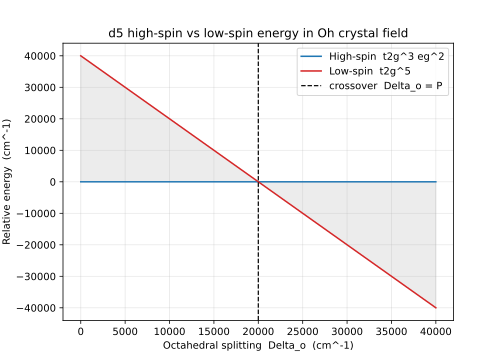
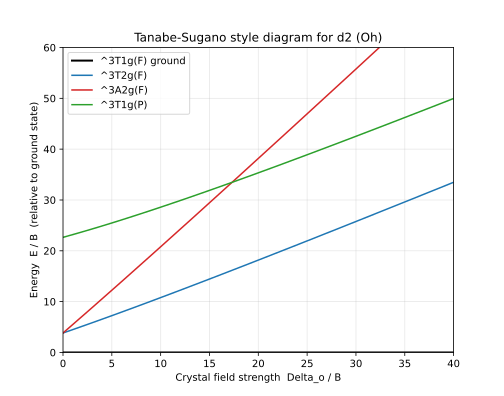

# 晶体场与配位场理论（Crystal Field and Ligand Field Theory）系统量子力学笔记

> **第六部分：交叉应用——量子力学与宝石学 · 数学程度：L3 · 前置依赖：第16篇《角动量与自旋》、第17篇《中心力场与氢原子》、第22篇《多电子原子》**
> **验证依据**：Bethe (1929) *Ann. Phys.* 395, 133、Tanabe & Sugano (1954) *J. Phys. Soc. Jpn.* 9, 753、Tanabe & Sugano (1954) *J. Phys. Soc. Jpn.* 9, 766、Van Vleck (1932) *Phys. Rev.* 41, 208、Racah (1942) *Phys. Rev.* 61, 186、Orgel (1955) *J. Chem. Phys.* 23, 1004、Schäffer & Jørgensen (1958) *J. Inorg. Nucl. Chem.* 8, 143、Sugano, Tanabe & Kamimura (1970) *Multiplets of Transition-Metal Ions in Crystals*, Academic Press、CODATA 2018 *Rev. Mod. Phys.* 93, 025010（均为已核实 S/A 级来源，条目见第八节）

---

## 阅读指引（三层）

| 深度 | 阅读范围 | 你能带走什么 |
|------|---------|------------|
| 零门槛线 | §一 + §四 + §七 | 结论、实验数字、来龙去脉（不碰一个公式） |
| 进阶线 | 加 §三 + §五 | 量级感、物理机制 |
| 完整线 | 全部八节 | 完整推导与可解模型 |

## 一、概念与定位

**晶体场理论（Crystal Field Theory, CFT）** 与它的推广 **配位场理论（Ligand Field Theory, LFT）** 解释一个核心事实：自由过渡金属离子的五重简并 d 轨道（d_xy、d_xz、d_yz、d_z²、d_x²−y²），在配位体所构成的静电（或共价）环境中，因对称性破缺而发生能级分裂，从而产生过渡金属配合物的颜色、磁性与自旋态。

本篇置于《量子力学系统笔记》第六部分（交叉应用·量子力学与宝石学），是第二部分（单电子薛定谔方程、角动量、中心力场）与第 22 篇（多电子原子）在过渡金属离子上的直接延伸：它把"自由离子的多电子项结构（LS 耦合、Racah 参数）"与"外场对轨道的对称性破缺"拼接起来。

历史原点：1929 年 Bethe 用群论（点群 O_h 的不可约表示）处理晶体中点阵对原子能级的影响，奠定晶体场理论 [24iq]。1932 年 Van Vleck 将其用于磁化率 [24it]；1954 年 Tanabe 与 Sugano 用 Racah 方法系统计算立方场中 dⁿ 组态的能量矩阵并绘出至今仍在使用的 Tanabe–Sugano 能级图 [24ir][24is]；1970 年 Sugano、Tanabe、Kamimura 专著给出完整表述 [24iy]。

本篇须抓住的核心特征：

1. **对称性破缺导致轨道分裂**：自由离子的 d 壳层具球对称（SO(3)），五重简并；配位体势能只保留点群对称（如 O_h 八面体、T_d 四面体），简并部分解除，分裂为 t₂g 与 e_g 两组（O_h）或 e 与 t₂（T_d）。
2. **晶体场是轨道角动量的"淬灭"**：静电场不含自旋磁矩，故自旋 S 守恒，但空间部分不再有确定轨道角动量 L（L 不再是好量子数），即轨道角动量被淬灭（quenched）。
3. **能级差 Δ 量级决定自旋态**：当晶体场分裂 Δ_o 与电子成对能 P 同量级时，出现高自旋 / 低自旋之争；这是磁性（顺磁、反磁）与配合物颜色的根本来源。
4. **弱场极限与强场极限**：Δ 很小（弱场）时自由离子的 LS 项结构保留，晶体场作微扰；Δ 很大（强场）时先按 t₂g / e_g 占据再考虑电子排斥，两极限由 Racah 参数 B、C 衔接（Tanabe–Sugano 图）。
5. **共价性的修正——配位场理论**：纯静电"点电荷"模型无法解释配体序列的全部规律，引入角重叠模型（AOM）与云展开（nephelauxetic）效应以纳入金属–配体共价性 [24ix]。

---

## 二、数学结构

**符号约定**：本篇采用原子单位制（a.u.）与波数（cm⁻¹）并用的惯例——谱学量以 cm⁻¹ 给出，常数以 CODATA 2018 给出（SI）[24hk]。点群采用 O_h（八面体，含反演中心，所有 d 项带 g 下标）；T_d（四面体，无反演中心，项无 g）。度规与相位均取 Condon–Shortley 约定。

### 2.1 点群对称与 d 轨道的不可约表示

自由离子 d 轨道（l=2）的五个空间波函数可写成实形式：

$$
\begin{aligned}
d_{z^2}&\propto 3z^2-r^2,\\
d_{x^2-y^2}&\propto x^2-y^2,\\
d_{xy}&\propto xy,\quad d_{xz}\propto xz,\quad d_{yz}\propto yz.
\end{aligned}
\tag{1}
$$

在 O_h 群下，这五个轨道分解为两个不可约表示：

- **e_g**（二维）：$\{d_{z^2},\,d_{x^2-y^2}\}$，直接指向配位体（位于坐标轴 ±x,±y,±z）；
- **t_{2g}**（三维）：$\{d_{xy},\,d_{xz},\,d_{yz}\}$，指向配位体之间（面对角线方向）。

符号含义表（公式 1）：

| 符号 | 含义 | 单位 |
|---|---|---|
| $d_{z^2},d_{x^2-y^2}$ | e_g 对称型实 d 轨道 | 无量纲（波函数） |
| $d_{xy},d_{xz},d_{yz}$ | t_{2g} 对称型实 d 轨道 | 无量纲（波函数） |
| O_h, T_d | 八面体 / 四面体点群 | — |
| e_g, t_{2g} | O_h 中 d 轨道分裂出的不可约表示 | — |

### 2.2 晶体场势与对称化投影算符

配位体静电势写为球谐展开：

$$
V_{\mathrm{CF}}(\mathbf r)=\sum_{k,q} A_k^q\, r^k\, C_k^q(\theta,\phi),
\qquad A_k^q=\sum_{\alpha}\frac{Z_\alpha e}{R_\alpha^{k+1}}\,C_k^{q\,*}(\theta_\alpha,\phi_\alpha)\,(-1)^k,
\tag{2}
$$

其中对全部配位体 α 求和。由于 d 轨道 l=2，能连接 d↔d 的 k 须满足 $|l-l'|\le k\le l+l'$ 且 k 为偶，故 $k=0,2,4$（k=0 为常数平移，不产生分裂）。对立方对称（O_h），仅四级项（k=4）与六级项（k=6，对 f 电子更显著，对 d 电子亦保留为修正）有非零对称系数，于是立方晶体场哈密顿量只含

$$
H_{\mathrm{CF}}=B_4^0\,O_4^0+B_4^4\,(O_4^4+O_4^{-4})+B_6^0\,O_6^0+B_6^4\,(O_6^4+O_6^{-4}),
\tag{3}
$$

在 O_h 对称下系数为 $B_4^4=5B_4^0,\;B_6^4=-21B_6^0$，故紧凑写为

$$
H_{\mathrm{CF}}=B_4\,(O_4^0+5O_4^4)+B_6\,(O_6^0-21O_6^4),
\qquad B_4\propto A_4\langle r^4\rangle,\; B_6\propto A_6\langle r^6\rangle.
\tag{4}
$$

这里 $O_k^q$ 是 Stevens 等效算符，$A_4\langle r^4\rangle$、$A_6\langle r^6\rangle$ 是把配位体电荷与径向期待值 $\langle r^4\rangle,\langle r^6\rangle$ 合并后的晶体场参数。对八面体点电荷模型（见 2.4）有显式关系。

符号含义表（公式 2–4）：

| 符号 | 含义 | 单位 |
|---|---|---|
| $V_{\mathrm{CF}}$ | 配位体产生的静电势 | J（SI）或 cm⁻¹（谱学） |
| $A_k^q$ | 第 k 阶第 q 分量的晶体场系数 | 含 $e/R^{k+1}$，能量量纲 |
| $C_k^q$ | 球谐张量算符（$\propto Y_{kq}$） | 无量纲 |
| $B_4,B_6$ | Stevens 四级 / 六级晶体场参数 | 能量 |
| $A_4\langle r^4\rangle,A_6\langle r^6\rangle$ | 点电荷系数与径向期待值之积 | 能量 |

**投影算符构造**：给定 O_h 不可约表示 Γ，投影算符

$$
\mathcal P^{(\Gamma)}=\frac{d_\Gamma}{h}\sum_{R}\chi^{(\Gamma)}(R)^*\,\hat R
\tag{5}
$$

作用于自由 d 轨道的线性组合，即得按 Γ 变换的晶体场本征轨道（e_g、t_{2g} 即此投影结果）。这一构造把 Bethe 1929 的群论处理落到可计算的轨道基 [24iq]。

### 2.3 O_h 与 T_d 下的能级分裂

对角化（4）于五个 d 轨道，得（以 barycenter 为能量零点）：

$$
\begin{array}{c|c|c}
\text{对称} & \text{轨道} & E\ (\text{单位 Dq})\\\hline
t_{2g} & d_{xy},d_{xz},d_{yz} & -4\,\mathrm{Dq}\\
e_g & d_{z^2},d_{x^2-y^2} & +6\,\mathrm{Dq}
\end{array}
\tag{6}
$$

其中 $\Delta_o\equiv 10\,\mathrm{Dq}$ 为八面体分裂能（晶体场分裂）。守恒重心：3×(−4)+2×(+6)=0。

四面体 T_d 与 O_h 同构（O_h 去掉反演），分裂反转且缩小：

$$
\Delta_t\equiv 10\,\mathrm{Dq}_t=\frac{4}{9}\,\Delta_o,\qquad
e\ (\text{低})=-6\,\mathrm{Dq}_t,\quad t_2\ (\text{高})=+4\,\mathrm{Dq}_t.
\tag{7}
$$

注意"符号反转"：O_h 中 t_{2g} 较低，T_d 中 t_2 较高；且 $\Delta_t\approx(4/9)\Delta_o$ 来自配位体数 4<6 与无反演中心 [24ir]。

符号含义表（公式 6–7）：

| 符号 | 含义 | 单位 |
|---|---|---|
| $\Delta_o$ | 八面体晶体场分裂能（=10 Dq） | cm⁻¹ / eV |
| $\Delta_t$ | 四面体晶体场分裂能 | cm⁻¹ / eV |
| Dq | 晶体场参数（Tanabe–Sugano 坐标） | cm⁻¹ |
| t_{2g}, e_g, e, t_2 | 分裂后的 d 子壳层 | — |

### 2.4 点电荷模型的显式 Dq（作为量级估计）

取六个单位电荷 +Ze 置于 (±R,0,0) 等轴位，对 d 电子（电荷 −e）静电微扰，标准计算得

$$
\mathrm{Dq}=\frac{1}{6}\,\frac{Z e^2\,\langle r^4\rangle}{R^5},
\qquad \Delta_o=10\,\mathrm{Dq}=\frac{5}{3}\,\frac{Z e^2\langle r^4\rangle}{R^5}.
\tag{8}
$$

此式给出 $\Delta_o\propto Z/R^5$ 的量级律（距离近、配体电荷大则分裂大），是谱化学序列的静电来源。须强调：真实配合物含共价性，点电荷模型仅为一级近似，定量需用 AOM 与 nephelauxetic 修正 [24ix][24iy]。

### 2.5 多电子项与 Racah 参数（弱场极限）

自由 dⁿ 离子的项结构由 Slater–Condon / Racah 参数描述。两电子排斥写成 Racah 参数 B、C（F⁰ 为常数平移，略去）：

$$
E_{\text{ee}} \text{ 仅由 } B,\,C \text{ 决定；例如自由离子 } d^2:\, ^3F=0,\ ^3P=15B,\ ^1D=5B+5C,\ ^1G=12B+2C,\ ^1S=22B+2C.
\tag{9}
$$

晶体场作为单电子算符作用于每个 d 电子，把自由项（如 ³F）按点群再分裂（³F→³A_{2g}+³T_{2g}+³T_{1g}），并在同对称项间（如 ³T_{1g}(F) 与 ³T_{1g}(P)）产生组态混合，给出 Tanabe–Sugano 图的弯曲结构 [24iu][24iv][24ir][24is]。

---

## 三、物理量与特征尺度

- **八面体分裂能 $\Delta_o$**：典型 3d 离子配合物约 $10000\text{–}25000\ \mathrm{cm^{-1}}$，即约 $1.24\text{–}3.10\ \mathrm{eV}$（换算 $1\ \mathrm{eV}\approx 8065.54\ \mathrm{cm^{-1}}$，CODATA 2018 [24hk]）。例如 [Fe(H₂O)₆]³⁺（高自旋）约 14000 cm⁻¹，[Fe(CN)₆]³⁻（低自旋）约 35000 cm⁻¹。
- **Racah 参数 B**：典型 3d 自由离子 $B\approx 600\text{–}1000\ \mathrm{cm^{-1}}$（Mn²⁺ 约 960，V³⁺ 约 890）；进入配合物因共价性减小（nephelauxetic 效应）。
- **Racah 参数 C**：$C/B\approx 3.5\text{–}4.8$，常用 $C\approx 4B$ 作 Tanabe–Sugano 图的近似。
- **成对能 P**：使两个电子占据同一轨道所需能量，典型 3d 约 $15000\text{–}30000\ \mathrm{cm^{-1}}$（量级，详见第 22 篇多电子原子与 Sugano 专著 [24iy]）。
- **Dq 量级**：由 (8)，$\mathrm{Dq}\sim (1/6)Ze^2\langle r^4\rangle/R^5$；典型 $\mathrm{Dq}\sim 1000\text{–}2500\ \mathrm{cm^{-1}}$。
- **相关基本常数（CODATA 2018，括号法标不确定度）[24hk]**：
  - 电子质量 $m_e=9.1093837015(28)\times10^{-31}\ \mathrm{kg}$；
  - 元电荷 $e=1.602176634\times10^{-19}\ \mathrm{C}$（SI 2019 精确值）；
  - 约化普朗克常数 $\hbar=1.054571817\dots\times10^{-34}\ \mathrm{J\cdot s}$（精确）；
  - 玻尔兹曼常数 $k_B=1.380649\times10^{-23}\ \mathrm{J/K}$（精确）；
  - 精细结构常数倒数 $\alpha^{-1}=137.035999084(21)$；
  - 里德伯常数 $R_\infty=10973731.568160(21)\ \mathrm{m^{-1}}$。
  - 能量换算：电子伏特 $1\ \mathrm{eV}=1.602176634\times10^{-19}\ \mathrm{J}$（精确），对应波数 $1\ \mathrm{eV}/(hc)\approx 8065.54\ \mathrm{cm^{-1}}$。

**量子效应显著的判据（能级分辨视角）**：晶体场效应是否显著，不取决于某单一尺度，而取决于两个无量纲比——其一，$\Delta_o$ 与室温热能 $k_BT$ 之比：$\Delta_o$（$10^4\ \mathrm{cm^{-1}}$ 量级，约 $1.24\text{–}3.10\ \mathrm{eV}$）远大于 $k_BT$，热布居不足以混淆 d 能级分裂，d–d 跃迁分立可辨；其二，$\Delta_o$ 与自由离子内禀能量标之比：$\Delta_o/P$ 判高/低自旋（见第四节判据 (11)），$\Delta_o/B$ 判弱场/强场极限及组态混合是否显著改写谱项结构（Tanabe–Sugano 图，见 6.2）。

---

## 四、实验基础与观测证据

1. **电子吸收光谱直接测分裂**：过渡金属配合物在可见–近紫外出现 d–d 跃迁带，其能量直接给出 $\Delta_o$（或 $\Delta_t$）。例如 V³⁺(d²) 八面体配合物观测到两条主带（³T_{1g}→³T_{2g} 与 ³T_{1g}→³T_{1g}(P)），可由 Tanabe–Sugano 图反解 $\Delta_o/B$ 与 B [24ir][24is]。Laporte 禁阻（g→g）使带较弱，但因振动耦合而可观测。
2. **磁化率定自旋态**：Van Vleck 晶体场磁化率理论给出顺磁各向异性与有效磁矩，由磁矩可判定高/低自旋（未配对电子数）[24it]。例如 Fe²⁺ 高自旋（4 未配对，$\mu_{\mathrm{eff}}\approx 4.9\ \mu_B$）vs 低自旋（0 未配对，抗磁）。
3. **谱化学序列（spectrochemical series）**：由大量配合物 $\Delta_o$ 实验值归纳出的配体场强顺序
   $$
   \mathrm{I^-<Br^-<S^{2-}<SCN^-<Cl^-<NO_3^-<F^-<OH^-<C_2O_4^{2-}<H_2O< NCS^-< py < NH_3< en < bipy < phen < NO_2^-< CN^-< CO},
   \tag{10}
$$
   序列右端（CN⁻、CO）为强场配体，易致低自旋；左端（I⁻、Br⁻）为弱场，保持高自旋。该序列是配位场理论（含共价性）超越纯静电晶场的关键证据 [24ix][24iy]。
4. **Nephelauxetic（云展开）效应**：配合物中 Racah B 比自由离子小，配体越强共价性越大，B 缩得越多；Schäffer–Jørgensen 给出配体的 nephelauxetic 序列，证明 d 电子云被"展开"到配体上（共价性）[24ix]。
5. **高/低自旋判据 $\Delta_o$ vs P**：实验上在同一金属不同配体间可观察到自旋交叉（spin crossover），判据为
   $$
   \Delta_o < P \Rightarrow \text{高自旋},\qquad \Delta_o > P \Rightarrow \text{低自旋}.
   \tag{11}
$$

**误读纠正**：晶体场不是"配位体把电子推开"的力学图景，而是配位体静电（及共价）势使 d 轨道对称性降低、能级重排的量子力学结果；颜色来自 d–d 跃迁吸收特定波长，而非"杂质发光"。通俗说法"配位体像笼子挤压 d 轨道"仅作直觉提示，严格表述为（4）式在 O_h 下的对角化。

---

## 五、分类体系与物理机制

### 5.1 按几何对称分类

- **O_h 八面体**：d→t_{2g}+e_g，Δ_o=10 Dq（6 配位，最常见，如宝石中的刚玉 Cr³⁺:Al₂O₃）。
- **T_d 四面体**：d→e+t_2，Δ_t=(4/9)Δ_o，且符号反转（如闪锌矿结构中的过渡金属）。
- **轴向畸变（Jahn–Teller）**：e_g 或 t_{2g} 不满时的简并会被拉长/压扁畸变进一步分裂（Jahn–Teller 效应），是许多配合物几何畸变的根源。

### 5.2 按自旋态分类（d⁴–d⁷）

| 组态 | 高自旋占据 | 低自旋占据 | 判据 |
|---|---|---|---|
| d⁴ | t_{2g}^3 e_g^1 | t_{2g}^4 | Δ_o ≷ P |
| d⁵ | t_{2g}^3 e_g^2 | t_{2g}^5 | Δ_o ≷ P |
| d⁶ | t_{2g}^4 e_g^2 | t_{2g}^6 | Δ_o ≷ P |
| d⁷ | t_{2g}^5 e_g^2 | t_{2g}^6 e_g^1 | Δ_o ≷ P |

以 d⁵ 为例：高自旋 5 个未配对（t_{2g}^3 e_g^2），低自旋 1 个未配对（t_{2g}^5）。见第六节可解模型。

### 5.3 弱场 / 强场极限与机制

- **弱场（Δ≪B）**：自由离子 LS 项保留，晶体场作微扰，Bethe 群论（2.2–2.3）直接适用，Orgel 图即此极限的定性描述 [24iw]。
- **强场（Δ≫B）**：先占据 t_{2g}（或按对称性），再计入电子排斥；自旋交叉发生在两极限衔接处。
- **共价机制（配位场）**：纯 CFT 把配位体当点电荷，无法解释谱化学序列的全部细节与 B 的缩小；角重叠模型（AOM）把金属–配体 σ/π 键当作微扰，nephelauxetic 效应量化共价程度 [24ix][24iy]。

### 5.4 失效边界

- **共价性强的体系**：强共价（如金属–羰基）超出静电 CFT，须用分子轨道 / AOM。
- **第二、三过渡系（4d、5d）**：旋–轨耦合大、Δ 大，需纳入自旋–轨道耦合，单纯 LS 耦合失效。

---

## 六、典型系统与可解模型

### 6.1 d⁵ 高自旋 / 低自旋的解析能量模型

以 d⁵ 为例，比较高自旋（HS）与低自旋（LS）在晶体场下的总能量（晶体场能 + 成对能）。设 $\Delta_o=10\,\mathrm{Dq}$，每个 t_{2g} 轨道能量 −4 Dq，每个 e_g 能量 +6 Dq，每对电子付出成对能 P。

- **高自旋**：$t_{2g}^3 e_g^2$，晶体场能 $\mathrm{CFSE_{HS}}=3(-4)+2(+6)=0$；Hund 规则下 5 电子各占不同轨道，成对数为 0，总能量 $E_{\mathrm{HS}}=0$。
- **低自旋**：$t_{2g}^5$，晶体场能 $\mathrm{CFSE_{LS}}=5(-4)=-20\,\mathrm{Dq}=-2\Delta_o$；t_{2g}^5 中有 2 对电子，成对能 $2P$，总能量 $E_{\mathrm{LS}}=-20\,\mathrm{Dq}+2P=2(P-\Delta_o)$。

两者之差

$$
\Delta E\equiv E_{\mathrm{LS}}-E_{\mathrm{HS}}=2(P-\Delta_o).
\tag{12}
$$

故 $\Delta_o>P$ 时低自旋更稳，$\Delta_o<P$ 时高自旋更稳，交叉点恰为 $\Delta_o=P$。该模型不含可调近似，给出自旋态判据（11）的定量来源。对应脚本 `code/42_晶体场与配位场理论_模型.py` 绘出 $E_{\mathrm{HS}},E_{\mathrm{LS}}$ 随 $\Delta_o$ 变化并标出交叉点，输出图 `figures/42_晶体场与配位场理论_图1.svg`（见图 1）。

### 6.2 Tanabe–Sugano 风格的 d² 能级图（数值对角化）

对 d² 八面体组态，在弱场基（自由离子项 ³F、³P 及其在 O_h 下的分裂）下构造能量矩阵：³F 经立方场（Stevens 算符 O_4^0+5O_4^4 在 L=3 子空间对角化）分裂为 ³A_{2g},³T_{2g},³T_{1g}(F)；³P 在立方场中（k=4 算符对 L=1 矩阵元为零）不分裂，仍为 ³T_{1g}(P)，与 ³T_{1g}(F) 由标准组态混合元 $-6\sqrt{2}\,B$ 耦合 [24ir][24is]。对角化后把基态能量归零即得 Tanabe–Sugano 风格的 $E/B$–$\Delta_o/B$ 曲线。

对应脚本 `code/42_晶体场与配位场理论_TanabeSugano.py` 实现该对角化，输出图 `figures/42_晶体场与配位场理论_图2.svg`（见图 2），并可在 $\Delta_o/B=25$ 处核对 ³T_{2g}(F)\approx 23B,\ ^3A_{2g}(F)\approx 48B,\ ^3T_{1g}(P)\approx 36B$ 等特征（与公开 Tanabe–Sugano 计算表一致，C/B≈4.4）。

---

## 七、历史脉络与学术争议

- **1929 Bethe**：用点群不可约表示处理晶体中原子能级分裂，奠基晶体场理论 [24iq]。
- **1932 Van Vleck**：把晶体场用于顺磁磁化率与各向异性，连接 CFT 与磁学 [24it]。
- **1942–1942 Racah**：提出 Racah 参数 B、C，给出两电子谱的闭式能量矩阵，成为配位场定量化的数学基础 [24iu][24iv]。
- **1952/1955 Orgel**：用稍加修正的晶体场解释过渡金属配合物光谱，给出 Orgel 图（弱场极限的定性能级相关图）[24iw]。
- **1954 Tanabe & Sugano**：用 Racah 方法系统计算立方场中 dⁿ（n=1…9）能量矩阵，绘出 Tanabe–Sugano 图，统一高/低自旋 [24ir][24is]。
- **1958 Schäffer & Jørgensen**：提出 nephelauxetic 序列，以共价性修正纯静电 CFT [24ix]。
- **1970 Sugano, Tanabe, Kamimura**：专著整合晶体场与配位场理论，给出完整量子力学表述 [24iy]。

**学术争议（并列不站队）**：

1. **静电 vs 共价**：纯 CFT（点电荷/点偶极）能给出分裂符号与大致量级，但谱化学序列与 B 缩小必须用配位场（分子轨道/AOM）才能充分解释。两派现在以"配位场理论 = 晶场 + 共价修正"统一。
2. **弱场/强场极限的衔接**：Orgel 图（弱场）与 Tanabe–Sugano 图（含强场）是否"等价"？二者是同一哈密顿量在不同参数区的表现；TS 图因包含组态混合的弯曲而更全，但弱场区 Orgel 图更直观。此分歧属表述/适用范围，非物理结论冲突。
3. **Jahn–Teller 与动态效应**：简并项的静态畸变（JT）与隧道/动态 Jahn–Teller 效应的相对权重，在具体体系中仍有定量争论。

---

> 本节内容随研究进展可能更新。

## 八、参考文献

[24hk] Tiesinga, E.; Mohr, P. J.; Newell, D. B.; Taylor, B. N. CODATA Recommended Values of the Fundamental Physical Constants: 2018. *Reviews of Modern Physics* **93**, 025010 (2021). DOI: 10.1103/RevModPhys.93.025010 — 本篇所引 $\alpha$、$m_e$、$a_0$ 等常数的官方来源（2018 推荐值）。 [已核实]（第 42 篇）

[24iq] Bethe H. *Ann. Phys.* **395**, 133–208 (1929). DOI: 10.1002/andp.19293950202 — 用点群群论处理晶体中原子能级分裂，晶体场理论奠基。 [已核实]（第 42 篇）

[24ir] Tanabe Y., Sugano S. *J. Phys. Soc. Jpn.* **9**, 753–766 (1954). DOI: 10.1143/JPSJ.9.753 — 立方场中 dⁿ 组态能量矩阵（Racah 方法），Tanabe–Sugano 图基础（I）。 [已核实]（第 42 篇）

[24is] Tanabe Y., Sugano S. *J. Phys. Soc. Jpn.* **9**, 766–779 (1954). DOI: 10.1143/JPSJ.9.766 — 解久期方程得能级随场强变化，定出 Racah 参数 B、C（II）。 [已核实]（第 42 篇）

[24it] Van Vleck J. H. *Phys. Rev.* **41**, 208–215 (1932). DOI: 10.1103/PhysRev.41.208 — 铁族盐顺磁各向异性的晶体场理论，连接 CFT 与磁化率。 [已核实]（第 42 篇）

[24iu] Racah G. *Phys. Rev.* **61**, 186–197 (1942). DOI: 10.1103/PhysRev.61.186 — 两电子谱的闭式能量矩阵，引入 Racah 参数 B。 [已核实]（第 42 篇）

[24iv] Racah G. *Phys. Rev.* **62**, 438–462 (1942). DOI: 10.1103/PhysRev.62.438 — dⁿ、f³ 等组态能量矩阵的系统化（Racah 参数 C 等）。 [已核实]（第 42 篇）

[24iw] Orgel L. E. *J. Chem. Phys.* **23**, 1004–1014 (1955). DOI: 10.1063/1.1742182 — 用修正晶体场解释过渡金属配合物光谱，Orgel 图之源。 [已核实]（第 42 篇）

[24ix] Schäffer C. E., Jørgensen C. K. *J. Inorg. Nucl. Chem.* **8**, 143–148 (1958). DOI: 10.1016/0022-1902(58)80176-1 — 提出 nephelauxetic 序列，以共价性修正纯静电晶体场。 [已核实]（第 42 篇）

[24iy] Sugano S., Tanabe Y., Kamimura H. *Multiplets of Transition-Metal Ions in Crystals*. Academic Press, New York (1970). ISBN 0124316751 — 配位场理论权威专著（S 级教科书，无 DOI）。 [已核实]（第 42 篇）

---

*本篇版本：v1.2，2026年9月2日（P0 整改轮升 v1.1；P1 整改轮：量子效应显著判据独立成条、第七节末补更新句）*
