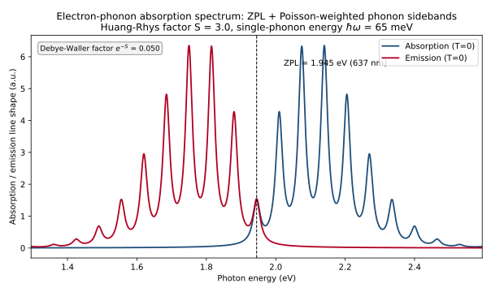
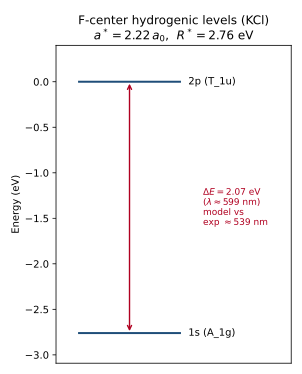
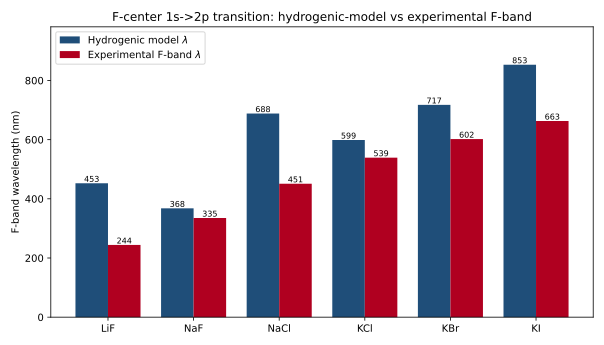

# 色心与晶格缺陷的量子描述（Quantum Description of Color Centers and Lattice Defects）系统量子力学笔记

> **第六部分：交叉应用——量子力学与宝石学 · 数学程度 L2 · 前置依赖：第17篇《中心力场与氢原子》、第26篇《量子统计》、第35篇《光场量子化与相干态》**

> **验证依据**：Gruber et al. (1997) Science（NV 中心）、Fowler (1968)（F 心）、Jelezko et al. (2004) PRL、Huang & Rhys (1950) Proc. R. Soc. A、Doherty et al. (2013) Physics Reports、Davies & Hamer (1976) Proc. R. Soc. A、Tamarat et al. (2006) PRL、Childress et al. (2006) Science、Lehmann & Bambauer (1973) Angew. Chem. Int. Ed.、Klick & Schulman (1957) Solid State Physics（以上均经 Web 逐条核实，标 [已核实]）

---

## 一、概念与定位

**定义**：色心（color center，德文 *Farbzentrum*）是晶体中由点缺陷（阴离子空位、间隙原子、杂质替代、空位–杂质复合体等）形成的**局域电子态**；它在禁带（带隙）内引入离散能级，通过吸收或发射可见光而令晶体呈色。严格地说，晶体"呈色"是这些局域态在可见光区的**选择性吸收**（透射补色），而非染料分子进入晶格。

**词源**：术语 *Farbzentrum* 由 Pohl 学派在 1930 年代的 Göttingen 提出；"F 心"的 F 取自德文 *Farbe*（颜色），指最基础、研究最充分的一类色心 [24jm]。

**核心特征（辨识度）**：

1. **点缺陷局域性**：缺陷态波函数局限于空位/杂质附近（尺度约 $a^{*}\sim 1\text{–}2$ 个晶格常数），与体相能带态的扩展性质不同。
2. **带隙内的分立能级**：在价带与导带之间引入受主/施主类局域能级，光学跃迁能量落在紫外~可见~近红外区间。
3. **显著的电子–声子耦合**：跃迁通常不只是一条锐线，而是零声子线（ZPL）叠加声子边带；黄昆因子 $S$ 定量衡量耦合强弱。
4. **自旋与对称性的可观测量**：如 NV 中心基态自旋 $S=1$、$C_{3v}$ 对称，其零场分裂 $D\approx 2.87\ \text{GHz}$ 使光学跃迁可自旋分辨 [24jt]。
5. **宝石学地位**：天然/处理致色的物理判据之一（紫晶、烟晶、辐照托帕石、钻石色等），是宝石学鉴定的量子力学基础。

**在体系中的位置**：色心是"晶体场/配位场理论（第 24 篇 能带、第 17 篇 中心力场与氢原子）"与"光场量子化（第 35 篇）"的交汇点——缺陷局域态用有效质量/紧束缚/分子轨道描述，光学响应由电子–声子耦合决定（温度依赖来自第 26 篇 量子统计）。

---

## 二、数学结构

**符号约定声明**：全文采用 **SI 单位制**；能量多用 eV，频率用 Hz/GHz。表象上，缺陷内禀态用原子轨道/分子轨道基（位置表象），自旋用 $S=1$ 球基。约定 $\hbar$ 显式写出、$2\pi$ 不并入；文中不中途切换单位制。

### 2.1 缺陷体系的总哈密顿量

$$
\hat H = \hat H_{\text{host}} + \hat V_{\text{defect}} + \hat H_{\text{ep}}
$$

| 符号 | 含义 | 量纲/单位 |
|------|------|-----------|
| $\hat H_{\text{host}}$ | 完美晶体的电子哈密顿量（周期势 + 电子–电子相互作用），其单电子本征态构成能带（第 24 篇） | 能量 [J]/[eV] |
| $\hat V_{\text{defect}}$ | 缺陷势（点离子势、杂质势），破坏平移对称性，在带隙中引入局域态 $\lvert d\rangle$ | 能量 |
| $\hat H_{\text{ep}}$ | 电子–声子耦合项，使电子态与晶格振动态（声子）纠缠 | 能量 |

### 2.2 局域态的描述：有效质量近似（类氢 F 心）

对 F 心——卤化物中一个**阴离子空位俘获一个电子**——在导带底附近电子有效质量 $m^{*}\approx m_{e}$，且电子运动快于离子位移，故介电屏蔽用**高频（光学）介电常数 $\varepsilon_{\infty}$** 而非静态 $\varepsilon_{s}$：

$$
\hat H_{F} = -\frac{\hbar^{2}}{2m^{*}}\nabla^{2} - \frac{e^{2}}{4\pi\varepsilon_{0}\varepsilon_{\infty} r}
$$

这是类氢哈密顿量，本征能级

$$
E_{n} = -\frac{R^{*}}{n^{2}},\qquad R^{*} = \frac{m^{*}}{m_{e}}\,\frac{R_{H}}{\varepsilon_{\infty}^{2}}
$$

其中 $R_{H}=13.605693009(84)\ \text{eV}$ 为氢原子里德伯能量（CODATA 2018）。基态为 $1s$（$A_{1g}$，球对称），第一激发为 $2p$（$T_{1u}$，三重简并）。F 吸收带对应 $1s\to 2p$：

$$
\Delta E_{F} = \left(1-\frac{1}{4}\right)R^{*}=\frac{3}{4}R^{*}
$$

| 符号 | 含义 | 量纲/单位 |
|------|------|-----------|
| $m^{*}$ | 缺陷中电子有效质量；F 心取 $m^{*}\approx m_{e}$ | 质量 [kg] |
| $\varepsilon_{\infty}$ | 高频（光学）介电常数 $\approx n_{\text{opt}}^{2}$ | 无量纲 |
| $R^{*}$ | 有效里德伯能量 | 能量 [eV] |
| $E_{n}$ | 第 $n$ 个类氢能级 | 能量 [eV] |

### 2.3 深中心（NV 等）的紧束缚 / 分子轨道描述

对 NV 中心（氮替代 + 相邻碳空位，$C_{3v}$ 对称），其三个未配对电子构成自旋 $S=1$ 基态，需用分子轨道（$a_{1}$、$e$ 轨道）描述电子组态 [24jo]。本节只给出可观测的基态自旋哈密顿量，分子轨道构造详见综述 [24jo]。

### 2.4 电子–声子耦合与黄昆因子

采用**构型坐标（configurational coordinate）**模型：电子基态与激发态的势能面均为谐振子，平衡位置相差 $\Delta Q$（晶格弛豫）。单模下电子–声子耦合写成

$$
\hat H_{\text{ep}} = \sum_{q}\hbar\omega_{q}\,\hat b_{q}^{\dagger}\hat b_{q}
+ \lvert e\rangle\langle e\rvert\sum_{q} V_{q}\left(\hat a_{q}+\hat a_{q}^{\dagger}\right)
$$

只让激发态 $\lvert e\rangle$ 与声子耦合，这正是"位移振子"的来源。

**黄昆因子（单模）**：

$$
S = \frac{E_{\text{reorg}}}{\hbar\omega}
= \frac{\tfrac{1}{2}M\omega^{2}(\Delta Q)^{2}}{\hbar\omega}
$$

| 符号 | 含义 | 量纲/单位 |
|------|------|-----------|
| $S$ | 黄昆因子（电子–声子耦合强度） | 无量纲 |
| $E_{\text{reorg}}$ | 晶格弛豫能（重组能） | 能量 [eV] |
| $\omega$ | 声子角频率 | [rad/s] |
| $M$ | 参与弛豫的有效质量 | 质量 [kg] |
| $\Delta Q$ | 两电子态势能面平衡位置之差 | 长度 [m] |

零声子线的相对强度由 **Debye–Waller 因子** 给出：

$$
W(T) = \exp\!\big[-S\,(2\bar n+1)\big],\qquad
\bar n = \frac{1}{\exp(\hbar\omega/k_{B}T)-1}
$$

$T=0$ 时 $\bar n=0$，故 $W(0)=e^{-S}$。

### 2.5 跃迁强度：Franck–Condon 因子（T=0）

吸收中每发射 $m$ 个声子的权重为泊松分布（T=0）：

$$
P_{m} = e^{-S}\frac{S^{m}}{m!}
$$

吸收线形（每条振动态用洛伦兹型 $L$ 展宽，半宽 $\gamma$）：

$$
I_{\text{abs}}(E)\propto\sum_{m=0}^{\infty}P_{m}\,L\!\big(E-(E_{\text{ZPL}}+m\hbar\omega),\,\gamma\big)
$$

发射（$m$ 个声子、能量降低）镜像对称：

$$
I_{\text{emi}}(E)\propto\sum_{m=0}^{\infty}P_{m}\,L\!\big(E-(E_{\text{ZPL}}-m\hbar\omega),\,\gamma\big)
$$

这解释了**斯托克斯位移**（发射比吸收红）。$E_{\text{ZPL}}$ 为零声子线能量。

### 2.6 NV 基态自旋哈密顿量（$S=1$，$C_{3v}$）

取零场横向分裂 $E\approx 0$ 的近似，基态自旋哈密顿量（能量单位）为

$$
\hat H_{gs} = D\,\hat S_{z}^{2} + g_{e}\mu_{B}\,\mathbf B\!\cdot\!\hat{\mathbf S}
$$

其中 $D\approx h\times 2.87\ \text{GHz}=1.19\times 10^{-5}\ \text{eV}$ 为零场分裂（zero-field splitting）；零场下 $m_{s}=0$ 与 $m_{s}=\pm1$ 分裂为 $D$，$m_{s}=\pm1$ 二重简并 [24jt]。

| 符号 | 含义 | 量纲/单位 |
|------|------|-----------|
| $\hat{\mathbf S}$ | 自旋算符（无量纲，$S=1$） | 无量纲 |
| $\hat S_{z}$ | 自旋 $z$ 分量算符 | 无量纲 |
| $D$ | 零场分裂常数 | 能量 [eV]（或频率 2.87 GHz） |
| $g_{e}$ | 电子 $g$ 因子 $\approx 2.0023$ | 无量纲 |
| $\mu_{B}$ | 玻尔磁子 | 能量/磁场 [J/T] |
| $\mathbf B$ | 外磁场 | [T] |

### 2.7 对称性与守恒量

F 心被 6 个阳离子包围，局域对称近似 $O_{h}$（球对称），群论给出 $1s$（$A_{1g}$）、$2p$（$T_{1u}$）的简并度；NV 心为 $C_{3v}$，轴向沿 N–V 方向，对称操作生成 $C_{3}$ 与镜面，约束能级分裂与跃迁选择定则。

---

## 三、物理量与特征尺度

基本常数采用 **CODATA 2018** 推荐值；2019 年国际单位制重新定义后 $e,h,\hbar,k_{B},c$ 为精确值，$m_{e},a_{0},\mu_{B},R_{H}$ 带不确定度。

| 物理量 | 符号 | 数值/量级 | 适用条件 |
|--------|------|-----------|----------|
| 电子质量 | $m_{e}$ | $9.1093837015(28)\times10^{-31}\ \text{kg}$（相对不确定度 $3.0\times10^{-10}$） | CODATA 2018 |
| 玻尔半径 | $a_{0}$ | $5.29177210903(80)\times10^{-11}\ \text{m}$ | CODATA 2018 |
| 氢原子里德伯能量 | $R_{H}$ | $13.605693009(84)\ \text{eV}$ | CODATA 2018 |
| 普朗克/约化普朗克常数 | $h,\hbar$ | $h=6.62607015\times10^{-34}\ \text{J·s}$（精确），$\hbar=1.054571817\times10^{-34}\ \text{J·s}$（精确） | 2019 重定义 |
| 玻尔磁子 | $\mu_{B}$ | $9.2740100783(28)\times10^{-24}\ \text{J/T}$ | CODATA 2018 |
| NV 零声子线 | $E_{\text{ZPL}}$ | $1.945\ \text{eV}$（$637\ \text{nm}$） | NV⁻ 中心 [24jp] |
| NV 零场分裂 | $D$ | $2.87\ \text{GHz}$（$=1.19\times10^{-5}\ \text{eV}$） | 基态 $S=1$ [24jt] |
| NV 黄昆因子 | $S$ | $\approx 3\text{–}4$（典型取值约 3–4） | 对应 $e^{-S}\approx 0.02\text{–}0.05$ [24jo][24js] |
| F 带能量（卤化物） | $E_{F}$ | KCl $\approx 2.30\ \text{eV}$（540 nm）；NaCl $\approx 2.75\ \text{eV}$（450 nm）；KBr $\approx 2.06\ \text{eV}$（600 nm）；LiF $\approx 5.1\ \text{eV}$（240 nm） | 阴离子空位 + 电子 [24jm][24jq] |
| 声子能量（NV 示意单模） | $\hbar\omega$ | $\approx 30\text{–}150\ \text{meV}$（模型取 65 meV） | 多个光学支叠加 [24js] |
| 有效玻尔半径（F 心） | $a^{*}$ | $\varepsilon_{\infty}a_{0}\approx(2\text{–}3)a_{0}\approx 1\text{–}1.6\ \text{Å}$ | 卤化物 |

**量子效应判据**：缺陷态局限尺度 $a^{*}$ 与带隙能级间距 $\Delta E\sim\text{eV}$ 远大于 $k_{B}T$（室温 $0.026\ \text{eV}$），故分立能级主导，连续近似失效。

---

## 四、实验基础与观测证据

### 4.1 关键实验

- **F 心吸收带**：Pohl 学派（1930s）用"加色"（碱金属蒸气退火）与 X 射线辐照在同一种卤化物中得到**完全相同**的 F 带位置与形状，证明 F 心 = 阴离子空位 + 一个电子 [24jm]。F 带为宽吸收（半宽约 $0.1\text{–}0.3\ \text{eV}$），随温度升高红移并展宽。
- **NV 单中心光学探测磁共振（ODMR）**：Gruber et al. (1997) 用室温共焦显微观察到单 NV 中心荧光并做单自旋磁共振，发现不同中心的零场分裂参数因应变而有差异 [24jk]。
- **单电子自旋相干振荡**：Jelezko et al. (2004) 观测单 NV 电子自旋的 Rabi 振荡与 Hahn 回波，室温相干时间达数微秒，并见 $^{14}\text{N}$ 核自旋超精细导致的量子拍 [24jl]。
- **NV 相干电子 + 核自旋量子比特**：Childress et al. (2006) 展示单 NV 电子自旋与邻近 $^{13}\text{C}$ 核自旋的相干耦合，文中明确给出基态自旋三重态、零场分裂 $2.87\ \text{GHz}$ [24jt]。
- **NV 寿命极限 ZPL**：Tamarat et al. (2006) 在液氦温度观测到寿命极限的 NV 光学激发线（ZPL 极窄、谱线长期稳定），并做电场斯塔克调谐 [24js]。
- **NV 1.945 eV 振动态带**：Davies & Hamer (1976) 系统研究 $1.945\ \text{eV}$（$=637\ \text{nm}$）振动态带，即 NV 零声子线 [24jp]。

### 4.2 里程碑时间线

| 年份 | 人物/团队 | 体系 | 关键结果 | 文献 |
|------|-----------|------|----------|------|
| 1930s | Pohl 等（Göttingen） | F 心 | 加色/X 射线得相同 F 带，确立空位+电子模型 | [24jm] |
| 1937 | de Boer | F 心 | 明确提出"阴离子空位俘获电子"图像 | [24jm] |
| 1940 | Mott & Gurney | 离子晶体 | 电子过程的量子力学处理 | [24jm] |
| 1950 | Huang & Rhys | F 心 | 基于 Franck–Condon 的吸收线形与黄昆因子理论 | [24jn] |
| 1976 | Davies & Hamer | NV | 1.945 eV 振动态带（ZPL 637 nm） | [24jp] |
| 1997 | Gruber 等 | NV | 单中心共焦荧光 + ODMR | [24jk] |
| 2004 | Jelezko 等 | NV | 单电子自旋相干振荡 | [24jl] |
| 2006 | Tamarat 等 | NV | 寿命极限 ZPL + 斯塔克调谐 | [24js] |
| 2006 | Childress 等 | NV | 电子 + $^{13}\text{C}$ 核自旋相干量子比特 | [24jt] |
| 2013 | Doherty 等 | NV | 综合综述（D、ZPL、S、对称性与开放问题） | [24jo] |

### 4.3 被排除的替代理论

F 心的"电子在导带自由运动"模型被排除：F 带位置随晶格常数系统变化（Mollwo–Ivey 律 $E_{F}\propto a^{-1.84}$），且加色与辐照样品一致，证明是**局域束缚态**而非自由载流子吸收 [24jm][24jq]。

### 4.4 常见误读纠正

> **通俗说法**："色心就是晶体被染色了。"——**严格表述**：色心是点缺陷在带隙引入的、可光学激发的局域电子态；晶体呈色是这些态在可见光区的选择性吸收（透射补色），并非有染料分子进入晶格。

> **通俗说法**："零声子线就是缺陷跃迁的全部。"——**严格表述**：ZPL 只占零温总强度的 $e^{-S}$（$S$ 大时仅几个百分点），大部分强度在声子边带；室温下因 $\bar n$ 增大，ZPL 进一步减弱。

### 4.5 实验局限

单中心光谱对表面、应变与电荷态敏感；NV 的不同电荷态（NV⁻ 与 NV⁰）光谱不同，必须分辨 [24jo]。F 带的精确峰位也受掺杂与温度影响。

---

## 五、分类体系与物理机制

### 5.1 分类表

| 类型 | 缺陷结构 | 机制 | 典型实例 | 文献 |
|------|----------|------|----------|------|
| F 心（电子心） | 阴离子空位 + 1 电子 | 类氢 $1s$；宽 F 吸收带 | 碱卤化物（KCl, NaCl） | [24jm][24jq] |
| F⁺ 心 | 阴离子空位 + 0 电子 | 氧空缺常见为 F⁺ | 氧化物（MgO 等） | [24jq] |
| F$_\text{A}$ 心 | F 心近邻一个异种碱离子 | 扰动类氢能级 | 碱卤化物 | [24jq] |
| V 心 / 空穴心 | 阳离子空位 + 空穴，或自陷空穴（V$_\text{k}=X_{2}^{-}$） | 受主类局域态 | 碱卤化物 | [24jm] |
| NV 中心 | N 替代 + 相邻 C 空位，$C_{3v}$，$S=1$ | 分子轨道 $a_{1},e$；ZPL 637 nm | 钻石 | [24jp][24jo] |
| 空穴色心（石英） | 杂质（Al³⁺ 替代 Si⁴⁺）+ 辐照产生空穴 $[\text{AlO}_{4}/\text{h}]^{0}$ | 空穴被杂质陷阱俘获 | 烟晶（smoky quartz） | [24jr] |
| 过渡金属/电荷转移致色 | Fe³⁺、Fe²⁺、Ti³⁺ 等 d–d 或电荷转移 | 晶体场/d–d 跃迁 | 紫晶（Fe³⁺ 相关）、蓝宝石等 | [24jr] |

> 注：紫晶（amethyst）的致色严格归属为 **Fe 相关色心**（Fe³⁺ 经辐照形成的电荷转移/晶体场跃迁），并非简单的 F 心；烟晶则是 Al 相关空穴心 [24jr]。

### 5.2 机制链条

点缺陷（空位/杂质）破坏周期势 → 带隙内引入局域态 → 电子–声子耦合使激发态势能面位移 → ZPL + 声子边带 → 可见光区选择性吸收/发射 → 晶体呈色。

### 5.3 概念辨析

- **电子心（F）vs 空穴心（V）**：前者为阴离子空位俘获电子（带隙上中部施主类），后者为阳离子空位 / 自陷空穴（受主类）；二者对称但非同一缺陷。
- **天然 vs 处理致色**：缺陷的*物理身份*（能级、对称性）在天然与处理样品中可相同；区别在生成历史（辐照剂量、热处理、扩散）。光学光谱常不足以唯一判定历史。
- **不站队声明**：宝石学"天然/处理"鉴定是概率性推断，不能仅凭量子力学单独判定（见第七节）。

### 5.4 失效边界

有效质量类氢模型仅在缺陷弱扰动、$m^{*}\approx m_{e}$、可用球对称屏蔽时近似成立（对大晶格 KCl 量级接近，小晶格 LiF/NaCl 偏差显著，需点离子模型）；强耦合（$S\gg 1$）时 ZPL 极弱，连续介质模型需修正。

---

## 六、典型系统与可解模型

### 6.1 模型 (a) 电子–声子耦合吸收谱（数值，ZPL + 泊松声子边带）

由 $\hat H_{\text{ep}}$ 在 $T=0$ 给出吸收线形 $I_{\text{abs}}(E)\propto\sum_{m}e^{-S}S^{m}/m!\,L(E-(E_{\text{ZPL}}+m\hbar\omega),\gamma)$。取 NV 近邻参数 $E_{\text{ZPL}}=1.945\ \text{eV}$、$S=3$、$\hbar\omega=65\ \text{meV}$，由脚本 `code/44_色心与晶格缺陷的量子描述_电子声子耦合吸收谱.py` 数值求和，并验证 **Debye–Waller 因子 $e^{-S}=0.0498$ 与数值积分 ZPL 面积占比（$0.053$）一致**（微小差异来自洛伦兹尾在 ZPL 窗口外的重叠）。

**图 1（英文图注见上）**：强电子–声子耦合色心的吸收（蓝）与发射（红）线形；虚线为零声子线 $1.945\ \text{eV}$（$637\ \text{nm}$）。零温 Debye–Waller 因子 $e^{-S}=0.0498$，说明大部分跃迁强度落在声子边带（表现为斯托克斯位移）。

### 6.2 模型 (b) F 心类氢模型（解析 + 数值）

由 $\hat H_{F}$ 解析得 $E_{n}=-R^{*}/n^{2}$，$R^{*}=R_{H}/\varepsilon_{\infty}^{2}$，$1s\to 2p$ 跃迁 $\Delta E=(3/4)R^{*}$。脚本 `code/44_色心与晶格缺陷的量子描述_F心类氢模型.py` 对 LiF/NaF/NaCl/KCl/KBr/KI 计算模型波长并与实验 F 带对比：

| 盐 | $\varepsilon_{\infty}$ | 模型 $\lambda$（nm） | 实验 F 带 $\lambda$（nm） | 比值 |
|----|------------------------|------------------------|----------------------------|------|
| LiF | 1.93 | 453 | 244 | 1.85 |
| NaCl | 2.38 | 688 | 451 | 1.53 |
| KCl | 2.22 | 599 | 539 | 1.11 |
| KBr | 2.43 | 717 | 602 | 1.19 |
| KI | 2.65 | 853 | 663 | 1.29 |

比值 $>1$ 表示模型低估能量、波长偏长。结论：**类氢零阶模型定性正确**（红移随晶格增大，与 Mollwo–Ivey 律方向一致），但定量需点离子模型修正——尤其小晶格（LiF、NaCl）偏差大，说明势能并非纯库仑屏蔽。

**图 2/3**：KCl 的 $1s/2p$ 类氢能级（模型 $\Delta E\approx 2.07\ \text{eV}\approx 599\ \text{nm}$ vs 实验 $\approx 540\ \text{nm}$）；以及各盐模型波长与实验 F 带波长的柱状对比。数值由 CODATA 2018 常数驱动（$a_{0},R_{H}$），不依赖 scipy。

---

## 七、历史脉络与学术争议

**提出动机**：1930 年代前，晶体呈色（如岩盐变黄、钻石彩色）缺少微观解释；Pohl 学派试图用点缺陷的电子态统一解释，并首次把"缺陷"从化学杂质中分离出来。

**争议 1：F 心模型**。"空位 + 电子"共识稳固（Pohl 加色/X 射线同带 → de Boer 1937 明确模型 → Mott & Gurney 1940 量子化）[24jm]。至今仍讨论的是*精确波函数*形式（Gourary–Markham 点离子模型 vs 有效质量近似），而非缺陷身份本身 [24jm][24jq]。

**争议 2：NV 作为量子比特的兴起**。从 1997 年单中心 ODMR，到 2004 年相干控制，再到 2006 年电子 + $^{13}\text{C}$ 核自旋相干寄存器 [24jk][24jl][24jt]，NV 成为固态量子信息的重要平台。其相干性受 $^{13}\text{C}$ 核自旋浴与电荷涨落限制，是**当前开放问题**（未解决，非诠释分歧）[24jt][24jo]。

**争议 3（宝石学，并列不站队）："天然 vs 处理（加热/辐照/扩散）致色"**。

- **天然派证据**：天然紫晶/烟晶的色心由地质辐照（U/Th 衰变）与自然热历史形成，色心分布常与生长环带相关 [24jr]。
- **处理派证据**：人工辐照 + 退火、扩散可制造相同色心结构（如辐照托帕石致蓝、处理钻石致粉/蓝、辐照石英），其光学光谱与天然样品难以区分 [24jr][24jo]。
- **共识边界**：缺陷*身份*可相同，但成因需结合多种手段（光致发光寿命、阴极发光、包裹体、元素分布、电子顺磁共振）做概率推断；**单凭吸收/发射光谱不能断言"天然"**。本笔记只陈述物理机制，不就具体样品真伪下结论。

> 提示：本节关于 NV 相干限制与色心归属的内容随研究进展可能更新。

---

## 八、参考文献

- [24jk] Gruber A., Dräbenstedt A., Tietz C., Fleury L., Wrachtrup J., von Borczyskowski C. (1997). Scanning confocal optical microscopy and magnetic resonance on single defect centers. *Science* **276**(5321), 2012–2014. DOI: 10.1126/science.276.5321.2012 — 首次在室温下单 NV 中心做共焦荧光与光学探测磁共振。 [已核实]（第 44 篇）
- [24jl] Jelezko F., Gaebel T., Popa I., Gruber A., Wrachtrup J. (2004). Observation of coherent oscillations in a single electron spin. *Physical Review Letters* **92**(7), 076401. DOI: 10.1103/PhysRevLett.92.076401 — 单 NV 电子自旋的 Rabi 振荡与室温相干。 [已核实]（第 44 篇）
- [24jm] Fowler W. B. (ed.) (1968). *Physics of Color Centers*. Academic Press, New York, xiii+655 pp. — F 心与色心权威专著，含 F 带数据、电子–声子章与 Pohl/de Boer 历史。 [已核实]（第 44 篇）
- [24jn] Huang K., Rhys A. (1950). Theory of light absorption and non-radiative transitions in F-centres. *Proceedings of the Royal Society of London A* **204**(1078), 406–423. DOI: 10.1098/rspa.1950.0184 — 基于 Franck–Condon 的 F 心吸收线形与黄昆因子理论。 [已核实]（第 44 篇）
- [24jo] Doherty M. W., Manson N. B., Delaney P., Jelezko F., Wrachtrup J., Hollenberg L. C. L. (2013). The nitrogen-vacancy colour centre in diamond. *Physics Reports* **528**(1), 1–45. DOI: 10.1016/j.physrep.2013.02.001 — NV 中心综合综述（D、ZPL、S、对称性与争议）。 [已核实]（第 44 篇）
- [24jp] Davies G., Hamer M. F. (1976). Optical studies of the 1.945 eV vibronic band in diamond. *Proceedings of the Royal Society of London A* **348**(1653), 285–298. DOI: 10.1098/rspa.1976.0039 — NV 零声子线 1.945 eV（637 nm）振动态带的开创工作。 [已核实]（第 44 篇）
- [24jq] Klick C. C., Schulman J. H. (1957). Luminescence in Solids. *Solid State Physics* **5**, 97–172. DOI: 10.1016/S0081-1947(08)60102-2 — 含 F 心吸收带数据、振子强度与 Smakula 公式。 [已核实]（第 44 篇）
- [24jr] Lehmann G., Bambauer H.-U. (1973). Quartz Crystals and Their Colors. *Angewandte Chemie International Edition* **12**(4), 283–291. DOI: 10.1002/anie.197302831 — 石英色心（紫晶/烟晶/辐照）的杂质–色心机制。 [已核实]（第 44 篇）
- [24js] Tamarat Ph., Gaebel T., Rabeau J. R., Khan M., Greentree A. D., Hollenberg L. C. L., Prawer S., Hemmer P., Jelezko F., Wrachtrup J. (2006). Stark shift control of single optical centers in diamond. *Physical Review Letters* **97**(8), 083002. DOI: 10.1103/PhysRevLett.97.083002 — NV 寿命极限 ZPL 与电场斯塔克调谐（电子–声子）。 [已核实]（第 44 篇）
- [24jt] Childress L., Gurudev Dutt M. V., Taylor J. M., Zibrov A. S., Jelezko F., Wrachtrup J., Hemmer P. R., Lukin M. D. (2006). Coherent dynamics of coupled electron and nuclear spin qubits in diamond. *Science* **314**(5797), 281–285. DOI: 10.1126/science.1131871 — 单 NV 电子与 $^{13}\text{C}$ 核自旋的相干耦合（量子比特兴起）。 [已核实]（第 44 篇）
