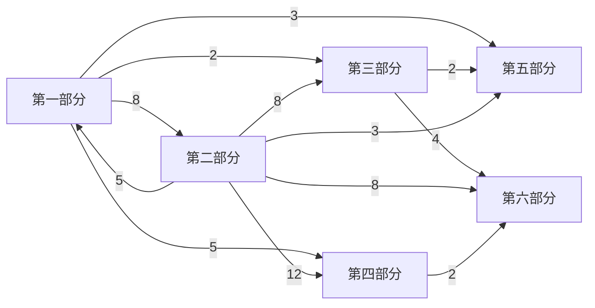

# 依赖关系与阅读路径

> 本篇由 `code/build_dependency_map.py` 从 47 篇头部的「前置依赖」行自动抽取生成，
> 不维护任何手写依赖。改动某篇的前置依赖后，重跑脚本即可同步本文件。

- 篇数：**47**　依赖边：**135** 条　无前置的起点篇：**1** 篇
- 校验：依赖目标存在 ✓　无自依赖 ✓　无断链 ✓　五段路径前置闭合 ✓
- 概念簇：**1** 个（环形依赖，非数据错误，见 §二）

---

## 一、依赖总览

### 1.1 被依赖最多的枢纽篇目

这些篇目是后续内容的共同基础，读通它们等于打通大半本书。

| 篇号 | 标题 | 难度 | 被依赖次数 |
|------|------|------|-----------|
| 09 | 量子态与叠加原理 | L2 | 20 |
| 12 | 算符表象 | L3 | 12 |
| 16 | 角动量与自旋 | L3 | 12 |
| 11 | 希尔伯特空间与狄拉克符号 | L2 | 10 |
| 13 | 薛定谔方程 | L2 | 8 |
| 17 | 中心力场与氢原子 | L3 | 8 |
| 21 | 全同粒子 | L3 | 8 |
| 01 | 量子行为 | L1 | 7 |

### 1.2 无前置的起点篇（1 篇）

零基础读者可从以下任一篇直接开始，不需要任何前置知识：

- **第 01 篇 量子行为**（L1）

## 二、核心概念簇（环形依赖）

以下篇目**互为前提**，构成一个不可分割的概念核。这不是数据错误，
而是量子力学形式体系的真实结构——叠加原理、不确定性关系、态矢量与算符
彼此定义，任何把它们排成严格线性顺序的尝试都会失真。

**读法建议**：把同一簇内的篇目当作一个整体，允许来回跳读；
第一遍只需读各篇的 §一（概念与定位），建立整体印象后再回头深入。

### 概念簇 1（5 篇）

| 篇号 | 标题 | 难度 | 簇内依赖 |
|------|------|------|---------|
| 07 | 物质波包 | L2 | 第09篇 |
| 08 | 不确定性关系 | L2 | 第07篇、第09篇、第12篇 |
| 09 | 量子态与叠加原理 | L2 | 第07篇、第08篇 |
| 11 | 希尔伯特空间与狄拉克符号 | L2 | 第09篇 |
| 12 | 算符表象 | L3 | 第09篇、第11篇 |

## 三、部分级依赖关系

六大部分之间的依赖结构（箭头方向：先修 → 后修，数字为跨部分依赖边数）：

- **第一部分 量子行为与基础概念**（10 篇）
- **第二部分 形式体系与数学结构**（10 篇）
- **第三部分 多体、对称与凝聚态**（8 篇）
- **第四部分 量子信息与量子光学**（8 篇）
- **第五部分 相对论量子理论与前沿**（5 篇）
- **第六部分 交叉应用——量子力学与宝石学**（6 篇）

## 四、篇级依赖邻接表

| 篇号 | 标题 | 难度 | 前置依赖 | 被哪些篇依赖 |
|------|------|------|---------|-------------|
| 01 | [量子行为](01_%E9%87%8F%E5%AD%90%E8%A1%8C%E4%B8%BA_%E7%B3%BB%E7%BB%9F%E7%AC%94%E8%AE%B0.md) | L1 | —（起点篇） | 第02篇、第03篇、第04篇、第05篇、第06篇、第07篇、第08篇 |
| 02 | [波粒二象性](02_%E6%B3%A2%E7%B2%92%E4%BA%8C%E8%B1%A1%E6%80%A7_%E7%B3%BB%E7%BB%9F%E7%AC%94%E8%AE%B0.md) | L2 | 第01篇 | 第05篇、第07篇、第08篇 |
| 03 | [黑体辐射](03_%E9%BB%91%E4%BD%93%E8%BE%90%E5%B0%84_%E7%B3%BB%E7%BB%9F%E7%AC%94%E8%AE%B0.md) | L2 | 第01篇、第09篇 | 第04篇、第05篇、第06篇 |
| 04 | [光电效应](04_%E5%85%89%E7%94%B5%E6%95%88%E5%BA%94_%E7%B3%BB%E7%BB%9F%E7%AC%94%E8%AE%B0.md) | L1 | 第01篇、第03篇 | — |
| 05 | [康普顿散射](05_%E5%BA%B7%E6%99%AE%E9%A1%BF%E6%95%A3%E5%B0%84_%E7%B3%BB%E7%BB%9F%E7%AC%94%E8%AE%B0.md) | L2 | 第01篇、第02篇、第03篇 | — |
| 06 | [原子光谱与玻尔模型](06_%E5%8E%9F%E5%AD%90%E5%85%89%E8%B0%B1%E4%B8%8E%E7%8E%BB%E5%B0%94%E6%A8%A1%E5%9E%8B_%E7%B3%BB%E7%BB%9F%E7%AC%94%E8%AE%B0.md) | L2 | 第01篇、第03篇、第17篇 | 第22篇 |
| 07 | [物质波包](07_%E7%89%A9%E8%B4%A8%E6%B3%A2%E5%8C%85_%E7%B3%BB%E7%BB%9F%E7%AC%94%E8%AE%B0.md) | L2 | 第01篇、第02篇、第09篇 | 第08篇、第09篇、第16篇 |
| 08 | [不确定性关系](08_%E4%B8%8D%E7%A1%AE%E5%AE%9A%E6%80%A7%E5%85%B3%E7%B3%BB_%E7%B3%BB%E7%BB%9F%E7%AC%94%E8%AE%B0.md) | L2 | 第01篇、第02篇、第07篇、第09篇、第12篇 | 第09篇 |
| 09 | [量子态与叠加原理](09_%E9%87%8F%E5%AD%90%E6%80%81%E4%B8%8E%E5%8F%A0%E5%8A%A0%E5%8E%9F%E7%90%86_%E7%B3%BB%E7%BB%9F%E7%AC%94%E8%AE%B0.md) | L2 | 第07篇、第08篇 | 第03篇、第07篇、第08篇、第10篇、第11篇、第12篇、第13篇、第15篇、第16篇、第18篇、第20篇、第21篇、第29篇、第30篇、第31篇、第34篇、第35篇、第37篇、第38篇、第40篇 |
| 10 | [测量理论](10_%E6%B5%8B%E9%87%8F%E7%90%86%E8%AE%BA_%E7%B3%BB%E7%BB%9F%E7%AC%94%E8%AE%B0.md) | L3 | 第09篇、第11篇、第12篇、第18篇 | — |
| 11 | [希尔伯特空间与狄拉克符号](11_%E5%B8%8C%E5%B0%94%E4%BC%AF%E7%89%B9%E7%A9%BA%E9%97%B4%E4%B8%8E%E7%8B%84%E6%8B%89%E5%85%8B%E7%AC%A6%E5%8F%B7_%E7%B3%BB%E7%BB%9F%E7%AC%94%E8%AE%B0.md) | L2 | 第09篇 | 第10篇、第12篇、第13篇、第16篇、第18篇、第20篇、第29篇、第30篇、第31篇、第32篇 |
| 12 | [算符表象](12_%E7%AE%97%E7%AC%A6%E8%A1%A8%E8%B1%A1_%E7%B3%BB%E7%BB%9F%E7%AC%94%E8%AE%B0.md) | L3 | 第09篇、第11篇 | 第08篇、第10篇、第13篇、第14篇、第15篇、第16篇、第17篇、第18篇、第19篇、第20篇、第34篇、第38篇 |
| 13 | [薛定谔方程](13_%E8%96%9B%E5%AE%9A%E8%B0%94%E6%96%B9%E7%A8%8B_%E7%B3%BB%E7%BB%9F%E7%AC%94%E8%AE%B0.md) | L2 | 第09篇、第11篇、第12篇 | 第14篇、第15篇、第17篇、第18篇、第19篇、第20篇、第37篇、第45篇 |
| 14 | [一维势场](14_%E4%B8%80%E7%BB%B4%E5%8A%BF%E5%9C%BA_%E7%B3%BB%E7%BB%9F%E7%AC%94%E8%AE%B0.md) | L3 | 第12篇、第13篇 | 第15篇、第17篇、第19篇 |
| 15 | [量子谐振子](15_%E9%87%8F%E5%AD%90%E8%B0%90%E6%8C%AF%E5%AD%90_%E7%B3%BB%E7%BB%9F%E7%AC%94%E8%AE%B0.md) | L3 | 第09篇、第12篇、第13篇、第14篇 | 第35篇、第36篇 |
| 16 | [角动量与自旋](16_%E8%A7%92%E5%8A%A8%E9%87%8F%E4%B8%8E%E8%87%AA%E6%97%8B_%E7%B3%BB%E7%BB%9F%E7%AC%94%E8%AE%B0.md) | L3 | 第07篇、第09篇、第11篇、第12篇 | 第17篇、第21篇、第24篇、第26篇、第27篇、第28篇、第30篇、第32篇、第36篇、第38篇、第42篇、第45篇 |
| 17 | [中心力场与氢原子](17_%E4%B8%AD%E5%BF%83%E5%8A%9B%E5%9C%BA%E4%B8%8E%E6%B0%A2%E5%8E%9F%E5%AD%90_%E7%B3%BB%E7%BB%9F%E7%AC%94%E8%AE%B0.md) | L3 | 第12篇、第13篇、第14篇、第16篇 | 第06篇、第19篇、第22篇、第23篇、第24篇、第42篇、第43篇、第44篇 |
| 18 | [绘景变换与密度矩阵](18_%E7%BB%98%E6%99%AF%E5%8F%98%E6%8D%A2%E4%B8%8E%E5%AF%86%E5%BA%A6%E7%9F%A9%E9%98%B5_%E7%B3%BB%E7%BB%9F%E7%AC%94%E8%AE%B0.md) | L3 | 第09篇、第11篇、第12篇、第13篇 | 第10篇、第29篇、第31篇 |
| 19 | [微扰论与变分法](19_%E5%BE%AE%E6%89%B0%E8%AE%BA%E4%B8%8E%E5%8F%98%E5%88%86%E6%B3%95_%E7%B3%BB%E7%BB%9F%E7%AC%94%E8%AE%B0.md) | L3 | 第12篇、第13篇、第14篇、第17篇 | 第20篇、第43篇、第46篇 |
| 20 | [路径积分与传播子](20_%E8%B7%AF%E5%BE%84%E7%A7%AF%E5%88%86%E4%B8%8E%E4%BC%A0%E6%92%AD%E5%AD%90_%E7%B3%BB%E7%BB%9F%E7%AC%94%E8%AE%B0.md) | L3 | 第09篇、第11篇、第12篇、第13篇、第19篇 | — |
| 21 | [全同粒子](21_%E5%85%A8%E5%90%8C%E7%B2%92%E5%AD%90_%E7%B3%BB%E7%BB%9F%E7%AC%94%E8%AE%B0.md) | L3 | 第09篇、第16篇 | 第22篇、第23篇、第24篇、第25篇、第26篇、第27篇、第28篇、第40篇 |
| 22 | [多电子原子](22_%E5%A4%9A%E7%94%B5%E5%AD%90%E5%8E%9F%E5%AD%90_%E7%B3%BB%E7%BB%9F%E7%AC%94%E8%AE%B0.md) | L2 | 第06篇、第17篇、第21篇 | 第23篇、第42篇 |
| 23 | [分子结构](23_%E5%88%86%E5%AD%90%E7%BB%93%E6%9E%84_%E7%B3%BB%E7%BB%9F%E7%AC%94%E8%AE%B0.md) | L3 | 第17篇、第21篇、第22篇 | — |
| 24 | [晶体中的电子与能带](24_%E6%99%B6%E4%BD%93%E4%B8%AD%E7%9A%84%E7%94%B5%E5%AD%90%E4%B8%8E%E8%83%BD%E5%B8%A6_%E7%B3%BB%E7%BB%9F%E7%AC%94%E8%AE%B0.md) | L3 | 第16篇、第17篇、第21篇 | 第25篇、第28篇、第46篇 |
| 25 | [半导体与pn结](25_%E5%8D%8A%E5%AF%BC%E4%BD%93%E4%B8%8Epn%E7%BB%93_%E7%B3%BB%E7%BB%9F%E7%AC%94%E8%AE%B0.md) | L2 | 第21篇、第24篇 | — |
| 26 | [量子统计](26_%E9%87%8F%E5%AD%90%E7%BB%9F%E8%AE%A1_%E7%B3%BB%E7%BB%9F%E7%AC%94%E8%AE%B0.md) | L3 | 第16篇、第21篇 | 第27篇、第41篇、第44篇、第46篇 |
| 27 | [超导与宏观量子现象](27_%E8%B6%85%E5%AF%BC%E4%B8%8E%E5%AE%8F%E8%A7%82%E9%87%8F%E5%AD%90%E7%8E%B0%E8%B1%A1_%E7%B3%BB%E7%BB%9F%E7%AC%94%E8%AE%B0.md) | L3 | 第16篇、第21篇、第26篇 | — |
| 28 | [量子霍尔效应](28_%E9%87%8F%E5%AD%90%E9%9C%8D%E5%B0%94%E6%95%88%E5%BA%94_%E7%B3%BB%E7%BB%9F%E7%AC%94%E8%AE%B0.md) | L3 | 第16篇、第21篇、第24篇 | — |
| 29 | [量子纠缠](29_%E9%87%8F%E5%AD%90%E7%BA%A0%E7%BC%A0_%E7%B3%BB%E7%BB%9F%E7%AC%94%E8%AE%B0.md) | L3 | 第09篇、第11篇、第18篇 | 第30篇、第31篇、第32篇、第33篇、第34篇 |
| 30 | [EPR佯谬与贝尔不等式](30_EPR%E4%BD%AF%E8%B0%AC%E4%B8%8E%E8%B4%9D%E5%B0%94%E4%B8%8D%E7%AD%89%E5%BC%8F_%E7%B3%BB%E7%BB%9F%E7%AC%94%E8%AE%B0.md) | L2 | 第09篇、第11篇、第16篇、第29篇 | 第32篇、第33篇 |
| 31 | [量子测量与退相干](31_%E9%87%8F%E5%AD%90%E6%B5%8B%E9%87%8F%E4%B8%8E%E9%80%80%E7%9B%B8%E5%B9%B2_%E7%B3%BB%E7%BB%9F%E7%AC%94%E8%AE%B0.md) | L3 | 第09篇、第11篇、第18篇、第29篇 | 第32篇 |
| 32 | [量子密钥分发](32_%E9%87%8F%E5%AD%90%E5%AF%86%E9%92%A5%E5%88%86%E5%8F%91_%E7%B3%BB%E7%BB%9F%E7%AC%94%E8%AE%B0.md) | L2 | 第11篇、第16篇、第29篇、第30篇、第31篇 | — |
| 33 | [量子隐形传态与密集编码](33_%E9%87%8F%E5%AD%90%E9%9A%90%E5%BD%A2%E4%BC%A0%E6%80%81%E4%B8%8E%E5%AF%86%E9%9B%86%E7%BC%96%E7%A0%81_%E7%B3%BB%E7%BB%9F%E7%AC%94%E8%AE%B0.md) | L2 | 第29篇、第30篇 | — |
| 34 | [量子计算与量子算法](34_%E9%87%8F%E5%AD%90%E8%AE%A1%E7%AE%97%E4%B8%8E%E9%87%8F%E5%AD%90%E7%AE%97%E6%B3%95_%E7%B3%BB%E7%BB%9F%E7%AC%94%E8%AE%B0.md) | L3 | 第09篇、第12篇、第29篇 | — |
| 35 | [光场量子化与相干态](35_%E5%85%89%E5%9C%BA%E9%87%8F%E5%AD%90%E5%8C%96%E4%B8%8E%E7%9B%B8%E5%B9%B2%E6%80%81_%E7%B3%BB%E7%BB%9F%E7%AC%94%E8%AE%B0.md) | L3 | 第09篇、第15篇 | 第36篇、第44篇、第45篇 |
| 36 | [腔量子电动力学与量子比特实现](36_%E8%85%94%E9%87%8F%E5%AD%90%E7%94%B5%E5%8A%A8%E5%8A%9B%E5%AD%A6%E4%B8%8E%E9%87%8F%E5%AD%90%E6%AF%94%E7%89%B9%E5%AE%9E%E7%8E%B0_%E7%B3%BB%E7%BB%9F%E7%AC%94%E8%AE%B0.md) | L3 | 第15篇、第16篇、第35篇 | — |
| 37 | [克莱因-戈登方程](37_%E5%85%8B%E8%8E%B1%E5%9B%A0-%E6%88%88%E7%99%BB%E6%96%B9%E7%A8%8B_%E7%B3%BB%E7%BB%9F%E7%AC%94%E8%AE%B0.md) | L3 | 第09篇、第13篇 | — |
| 38 | [狄拉克方程](38_%E7%8B%84%E6%8B%89%E5%85%8B%E6%96%B9%E7%A8%8B_%E7%B3%BB%E7%BB%9F%E7%AC%94%E8%AE%B0.md) | L3 | 第09篇、第12篇、第16篇 | 第39篇、第40篇 |
| 39 | [反粒子与狄拉克海](39_%E5%8F%8D%E7%B2%92%E5%AD%90%E4%B8%8E%E7%8B%84%E6%8B%89%E5%85%8B%E6%B5%B7_%E7%B3%BB%E7%BB%9F%E7%AC%94%E8%AE%B0.md) | L2 | 第38篇 | — |
| 40 | [量子场论的基本图像](40_%E9%87%8F%E5%AD%90%E5%9C%BA%E8%AE%BA%E7%9A%84%E5%9F%BA%E6%9C%AC%E5%9B%BE%E5%83%8F_%E7%B3%BB%E7%BB%9F%E7%AC%94%E8%AE%B0.md) | L3 | 第09篇、第21篇、第38篇 | 第41篇 |
| 41 | [量子引力与全息原理](41_%E9%87%8F%E5%AD%90%E5%BC%95%E5%8A%9B%E4%B8%8E%E5%85%A8%E6%81%AF%E5%8E%9F%E7%90%86_%E7%B3%BB%E7%BB%9F%E7%AC%94%E8%AE%B0.md) | L1 | 第26篇、第40篇 | — |
| 42 | [晶体场与配位场理论](42_%E6%99%B6%E4%BD%93%E5%9C%BA%E4%B8%8E%E9%85%8D%E4%BD%8D%E5%9C%BA%E7%90%86%E8%AE%BA_%E7%B3%BB%E7%BB%9F%E7%AC%94%E8%AE%B0.md) | L3 | 第16篇、第17篇、第22篇 | 第43篇、第47篇 |
| 43 | [过渡金属离子致色的量子机制](43_%E8%BF%87%E6%B8%A1%E9%87%91%E5%B1%9E%E7%A6%BB%E5%AD%90%E8%87%B4%E8%89%B2%E7%9A%84%E9%87%8F%E5%AD%90%E6%9C%BA%E5%88%B6_%E7%B3%BB%E7%BB%9F%E7%AC%94%E8%AE%B0.md) | L2 | 第17篇、第19篇、第42篇 | 第47篇 |
| 44 | [色心与晶格缺陷的量子描述](44_%E8%89%B2%E5%BF%83%E4%B8%8E%E6%99%B6%E6%A0%BC%E7%BC%BA%E9%99%B7%E7%9A%84%E9%87%8F%E5%AD%90%E6%8F%8F%E8%BF%B0_%E7%B3%BB%E7%BB%9F%E7%AC%94%E8%AE%B0.md) | L2 | 第17篇、第26篇、第35篇 | 第47篇 |
| 45 | [光谱学仪器的量子基础](45_%E5%85%89%E8%B0%B1%E5%AD%A6%E4%BB%AA%E5%99%A8%E7%9A%84%E9%87%8F%E5%AD%90%E5%9F%BA%E7%A1%80_%E7%B3%BB%E7%BB%9F%E7%AC%94%E8%AE%B0.md) | L2 | 第13篇、第16篇、第35篇 | 第47篇 |
| 46 | [矿物光学性质的第一性原理计算](46_%E7%9F%BF%E7%89%A9%E5%85%89%E5%AD%A6%E6%80%A7%E8%B4%A8%E7%9A%84%E7%AC%AC%E4%B8%80%E6%80%A7%E5%8E%9F%E7%90%86%E8%AE%A1%E7%AE%97_%E7%B3%BB%E7%BB%9F%E7%AC%94%E8%AE%B0.md) | L3 | 第19篇、第24篇、第26篇 | — |
| 47 | [宝石学中的量子误用辨析](47_%E5%AE%9D%E7%9F%B3%E5%AD%A6%E4%B8%AD%E7%9A%84%E9%87%8F%E5%AD%90%E8%AF%AF%E7%94%A8%E8%BE%A8%E6%9E%90_%E7%B3%BB%E7%BB%9F%E7%AC%94%E8%AE%B0.md) | L2 | 第42篇、第43篇、第44篇、第45篇 | — |

## 五、五段推荐路径

每段路径都经过**前置闭合校验**：路径内任意一篇的前置篇目，也都包含在路径内。
按路径顺序读，不会撞见没读过的概念。

### 路径 1A · 最小轮廓线（零门槛起步）

**只想花最短时间建立量子力学完整轮廓的读者，走这一条。**它的定义是：读完全书仅有的 3 篇 L1 篇目（量子行为、光电效应、量子引力与全息原理）所必需的全部前置——机器按传递闭包算出，共 15 篇，闭合自洽。读法：L1/L2 篇读「§一 概念与定位 + §四 实验基础与观测证据 + §七 历史脉络与学术争议」三节；L3 篇**只读其 §一 的一句话结论**。全程不碰推导。

- 涉及篇目：**15 篇**（含为满足前置而纳入的篇目）
- 前置闭合校验：**通过**

| 顺序 | 篇号 | 标题 | 难度 | 本路径的读法 |
|------|------|------|------|-------------|
| 1 | 01 | 量子行为 | L1 | 读 §一、四、七 |
| 2 | 02 | 波粒二象性 | L2 | 读 §一、四、七 |
| 3 | 07 | 物质波包 | L2 | 读 §一、四、七 |
| 4 | 08 | 不确定性关系 | L2 | 读 §一、四、七 |
| 5 | 09 | 量子态与叠加原理 | L2 | 读 §一、四、七 |
| 6 | 11 | 希尔伯特空间与狄拉克符号 | L2 | 读 §一、四、七 |
| 7 | 12 | 算符表象 | L3 | **只读 §一 的一句话结论** |
| 8 | 03 | 黑体辐射 | L2 | 读 §一、四、七 |
| 9 | 04 | 光电效应 | L1 | 读 §一、四、七 |
| 10 | 16 | 角动量与自旋 | L3 | **只读 §一 的一句话结论** |
| 11 | 21 | 全同粒子 | L3 | **只读 §一 的一句话结论** |
| 12 | 26 | 量子统计 | L3 | **只读 §一 的一句话结论** |
| 13 | 38 | 狄拉克方程 | L3 | **只读 §一 的一句话结论** |
| 14 | 40 | 量子场论的基本图像 | L3 | **只读 §一 的一句话结论** |
| 15 | 41 | 量子引力与全息原理 | L1 | 读 §一、四、七 |

### 路径 1B · 完整通识线（零门槛全覆盖）

想在零推导前提下尽可能多覆盖的读者，走这一条：全部 L1/L2 篇目（22 篇）加上为满足前置而纳入的 L3 篇目（仅读 §一 的一句话结论）。读完约等于一本不含数学的量子力学通识讲义。

- 涉及篇目：**38 篇**（含为满足前置而纳入的篇目）
- 前置闭合校验：**通过**

| 顺序 | 篇号 | 标题 | 难度 | 本路径的读法 |
|------|------|------|------|-------------|
| 1 | 01 | 量子行为 | L1 | 读 §一、四、七 |
| 2 | 02 | 波粒二象性 | L2 | 读 §一、四、七 |
| 3 | 07 | 物质波包 | L2 | 读 §一、四、七 |
| 4 | 08 | 不确定性关系 | L2 | 读 §一、四、七 |
| 5 | 09 | 量子态与叠加原理 | L2 | 读 §一、四、七 |
| 6 | 11 | 希尔伯特空间与狄拉克符号 | L2 | 读 §一、四、七 |
| 7 | 12 | 算符表象 | L3 | **只读 §一 的一句话结论** |
| 8 | 03 | 黑体辐射 | L2 | 读 §一、四、七 |
| 9 | 04 | 光电效应 | L1 | 读 §一、四、七 |
| 10 | 05 | 康普顿散射 | L2 | 读 §一、四、七 |
| 11 | 13 | 薛定谔方程 | L2 | 读 §一、四、七 |
| 12 | 14 | 一维势场 | L3 | **只读 §一 的一句话结论** |
| 13 | 16 | 角动量与自旋 | L3 | **只读 §一 的一句话结论** |
| 14 | 17 | 中心力场与氢原子 | L3 | **只读 §一 的一句话结论** |
| 15 | 06 | 原子光谱与玻尔模型 | L2 | 读 §一、四、七 |
| 16 | 18 | 绘景变换与密度矩阵 | L3 | **只读 §一 的一句话结论** |
| 17 | 15 | 量子谐振子 | L3 | **只读 §一 的一句话结论** |
| 18 | 19 | 微扰论与变分法 | L3 | **只读 §一 的一句话结论** |
| 19 | 21 | 全同粒子 | L3 | **只读 §一 的一句话结论** |
| 20 | 22 | 多电子原子 | L2 | 读 §一、四、七 |
| 21 | 24 | 晶体中的电子与能带 | L3 | **只读 §一 的一句话结论** |
| 22 | 25 | 半导体与pn结 | L2 | 读 §一、四、七 |
| 23 | 26 | 量子统计 | L3 | **只读 §一 的一句话结论** |
| 24 | 29 | 量子纠缠 | L3 | **只读 §一 的一句话结论** |
| 25 | 30 | EPR佯谬与贝尔不等式 | L2 | 读 §一、四、七 |
| 26 | 31 | 量子测量与退相干 | L3 | **只读 §一 的一句话结论** |
| 27 | 32 | 量子密钥分发 | L2 | 读 §一、四、七 |
| 28 | 33 | 量子隐形传态与密集编码 | L2 | 读 §一、四、七 |
| 29 | 35 | 光场量子化与相干态 | L3 | **只读 §一 的一句话结论** |
| 30 | 38 | 狄拉克方程 | L3 | **只读 §一 的一句话结论** |
| 31 | 39 | 反粒子与狄拉克海 | L2 | 读 §一、四、七 |
| 32 | 40 | 量子场论的基本图像 | L3 | **只读 §一 的一句话结论** |
| 33 | 41 | 量子引力与全息原理 | L1 | 读 §一、四、七 |
| 34 | 42 | 晶体场与配位场理论 | L3 | **只读 §一 的一句话结论** |
| 35 | 43 | 过渡金属离子致色的量子机制 | L2 | 读 §一、四、七 |
| 36 | 44 | 色心与晶格缺陷的量子描述 | L2 | 读 §一、四、七 |
| 37 | 45 | 光谱学仪器的量子基础 | L2 | 读 §一、四、七 |
| 38 | 47 | 宝石学中的量子误用辨析 | L2 | 读 §一、四、七 |

### 路径 2 · 物理系主线

面向需要完整掌握形式体系的读者，按拓扑序通读全部 47 篇，含 §二 数学结构与 §六 可解模型的全部推导。

- 涉及篇目：**47 篇**（含为满足前置而纳入的篇目）
- 前置闭合校验：**通过**

| 顺序 | 篇号 | 标题 | 难度 | 备注 |
|------|------|------|------|------|
| 1 | 01 | 量子行为 | L1 | 目标篇 |
| 2 | 02 | 波粒二象性 | L2 | 目标篇 |
| 3 | 07 | 物质波包 | L2 | 目标篇 |
| 4 | 08 | 不确定性关系 | L2 | 目标篇 |
| 5 | 09 | 量子态与叠加原理 | L2 | 目标篇 |
| 6 | 11 | 希尔伯特空间与狄拉克符号 | L2 | 目标篇 |
| 7 | 12 | 算符表象 | L3 | 目标篇 |
| 8 | 03 | 黑体辐射 | L2 | 目标篇 |
| 9 | 04 | 光电效应 | L1 | 目标篇 |
| 10 | 05 | 康普顿散射 | L2 | 目标篇 |
| 11 | 13 | 薛定谔方程 | L2 | 目标篇 |
| 12 | 14 | 一维势场 | L3 | 目标篇 |
| 13 | 16 | 角动量与自旋 | L3 | 目标篇 |
| 14 | 17 | 中心力场与氢原子 | L3 | 目标篇 |
| 15 | 06 | 原子光谱与玻尔模型 | L2 | 目标篇 |
| 16 | 18 | 绘景变换与密度矩阵 | L3 | 目标篇 |
| 17 | 10 | 测量理论 | L3 | 目标篇 |
| 18 | 15 | 量子谐振子 | L3 | 目标篇 |
| 19 | 19 | 微扰论与变分法 | L3 | 目标篇 |
| 20 | 20 | 路径积分与传播子 | L3 | 目标篇 |
| 21 | 21 | 全同粒子 | L3 | 目标篇 |
| 22 | 22 | 多电子原子 | L2 | 目标篇 |
| 23 | 23 | 分子结构 | L3 | 目标篇 |
| 24 | 24 | 晶体中的电子与能带 | L3 | 目标篇 |
| 25 | 25 | 半导体与pn结 | L2 | 目标篇 |
| 26 | 26 | 量子统计 | L3 | 目标篇 |
| 27 | 27 | 超导与宏观量子现象 | L3 | 目标篇 |
| 28 | 28 | 量子霍尔效应 | L3 | 目标篇 |
| 29 | 29 | 量子纠缠 | L3 | 目标篇 |
| 30 | 30 | EPR佯谬与贝尔不等式 | L2 | 目标篇 |
| 31 | 31 | 量子测量与退相干 | L3 | 目标篇 |
| 32 | 32 | 量子密钥分发 | L2 | 目标篇 |
| 33 | 33 | 量子隐形传态与密集编码 | L2 | 目标篇 |
| 34 | 34 | 量子计算与量子算法 | L3 | 目标篇 |
| 35 | 35 | 光场量子化与相干态 | L3 | 目标篇 |
| 36 | 36 | 腔量子电动力学与量子比特实现 | L3 | 目标篇 |
| 37 | 37 | 克莱因-戈登方程 | L3 | 目标篇 |
| 38 | 38 | 狄拉克方程 | L3 | 目标篇 |
| 39 | 39 | 反粒子与狄拉克海 | L2 | 目标篇 |
| 40 | 40 | 量子场论的基本图像 | L3 | 目标篇 |
| 41 | 41 | 量子引力与全息原理 | L1 | 目标篇 |
| 42 | 42 | 晶体场与配位场理论 | L3 | 目标篇 |
| 43 | 43 | 过渡金属离子致色的量子机制 | L2 | 目标篇 |
| 44 | 44 | 色心与晶格缺陷的量子描述 | L2 | 目标篇 |
| 45 | 45 | 光谱学仪器的量子基础 | L2 | 目标篇 |
| 46 | 46 | 矿物光学性质的第一性原理计算 | L3 | 目标篇 |
| 47 | 47 | 宝石学中的量子误用辨析 | L2 | 目标篇 |

### 路径 3 · 宝石学交叉线

面向宝石学从业者：以第六部分 6 篇为目标，回溯其全部前置。建议非数学背景者先按路径 1 的方式过一遍前置篇的 §一，再回到本篇读 §四 与 §五。

- 涉及篇目：**26 篇**（含为满足前置而纳入的篇目）
- 前置闭合校验：**通过**

| 顺序 | 篇号 | 标题 | 难度 | 备注 |
|------|------|------|------|------|
| 1 | 01 | 量子行为 | L1 | 前置篇 |
| 2 | 02 | 波粒二象性 | L2 | 前置篇 |
| 3 | 07 | 物质波包 | L2 | 前置篇 |
| 4 | 08 | 不确定性关系 | L2 | 前置篇 |
| 5 | 09 | 量子态与叠加原理 | L2 | 前置篇 |
| 6 | 11 | 希尔伯特空间与狄拉克符号 | L2 | 前置篇 |
| 7 | 12 | 算符表象 | L3 | 前置篇 |
| 8 | 03 | 黑体辐射 | L2 | 前置篇 |
| 9 | 13 | 薛定谔方程 | L2 | 前置篇 |
| 10 | 14 | 一维势场 | L3 | 前置篇 |
| 11 | 16 | 角动量与自旋 | L3 | 前置篇 |
| 12 | 17 | 中心力场与氢原子 | L3 | 前置篇 |
| 13 | 06 | 原子光谱与玻尔模型 | L2 | 前置篇 |
| 14 | 15 | 量子谐振子 | L3 | 前置篇 |
| 15 | 19 | 微扰论与变分法 | L3 | 前置篇 |
| 16 | 21 | 全同粒子 | L3 | 前置篇 |
| 17 | 22 | 多电子原子 | L2 | 前置篇 |
| 18 | 24 | 晶体中的电子与能带 | L3 | 前置篇 |
| 19 | 26 | 量子统计 | L3 | 前置篇 |
| 20 | 35 | 光场量子化与相干态 | L3 | 前置篇 |
| 21 | 42 | 晶体场与配位场理论 | L3 | 目标篇 |
| 22 | 43 | 过渡金属离子致色的量子机制 | L2 | 目标篇 |
| 23 | 44 | 色心与晶格缺陷的量子描述 | L2 | 目标篇 |
| 24 | 45 | 光谱学仪器的量子基础 | L2 | 目标篇 |
| 25 | 46 | 矿物光学性质的第一性原理计算 | L3 | 目标篇 |
| 26 | 47 | 宝石学中的量子误用辨析 | L2 | 目标篇 |

### 路径 4 · 前沿窗口线

面向想了解理论前沿的读者：以第五部分 5 篇为目标，回溯其全部前置。这一路径的终点是量子引力与全息原理（第 41 篇，L1，不需要推导即可读）。

- 涉及篇目：**16 篇**（含为满足前置而纳入的篇目）
- 前置闭合校验：**通过**

| 顺序 | 篇号 | 标题 | 难度 | 备注 |
|------|------|------|------|------|
| 1 | 01 | 量子行为 | L1 | 前置篇 |
| 2 | 02 | 波粒二象性 | L2 | 前置篇 |
| 3 | 07 | 物质波包 | L2 | 前置篇 |
| 4 | 08 | 不确定性关系 | L2 | 前置篇 |
| 5 | 09 | 量子态与叠加原理 | L2 | 前置篇 |
| 6 | 11 | 希尔伯特空间与狄拉克符号 | L2 | 前置篇 |
| 7 | 12 | 算符表象 | L3 | 前置篇 |
| 8 | 13 | 薛定谔方程 | L2 | 前置篇 |
| 9 | 16 | 角动量与自旋 | L3 | 前置篇 |
| 10 | 21 | 全同粒子 | L3 | 前置篇 |
| 11 | 26 | 量子统计 | L3 | 前置篇 |
| 12 | 37 | 克莱因-戈登方程 | L3 | 目标篇 |
| 13 | 38 | 狄拉克方程 | L3 | 目标篇 |
| 14 | 39 | 反粒子与狄拉克海 | L2 | 目标篇 |
| 15 | 40 | 量子场论的基本图像 | L3 | 目标篇 |
| 16 | 41 | 量子引力与全息原理 | L1 | 目标篇 |

## 六、维护方式

1. 修改某篇的**前置依赖**或**数学程度**标注（在该篇头部）。
2. 重跑 `python3 code/build_dependency_map.py`，本文件整体重新生成。
3. 脚本内置校验：依赖目标存在、无自依赖、无断链、路径前置闭合；环形依赖识别为概念簇而非报错。

---

*本篇由脚本生成 · 数据来源为各篇头部 · 与《序》的目录表交叉一致*
